```python
import pandas as pd
import numpy as np
import scipy as sp
import matplotlib.pyplot as plt
import re
from scipy.sparse import csr_matrix

print(pd.__version__)
```

    0.24.2
    

# Pre-processing


```python
df = pd.read_csv("pokemon_revised.csv", encoding='utf-8')

# Drop extra indentifiers (Redundant information)
df = df.drop('japanese_name', 1)
df = df.drop('classfication', 1)
#df = df.drop('pokedex_number', 1)
```


```python
# Combine dataframes
def append_df(df1, df2):
    for col in df1:
        df2[col] = df1[col]
    return df2

# One-hot encoding on Pokemon abilities
def expand_abilities(df):
    clean_abilities = df['abilities'].apply(lambda x: re.findall('(?<=\')[^,].+?(?=\')', x))
    abilities = np.hstack(clean_abilities.values)
    p_array = np.array(clean_abilities)

    # Building term-document matrix
    # https://docs.scipy.org/doc/scipy/reference/generated/scipy.sparse.csr_matrix.html
    indptr = [0]
    indices = []
    data = []
    vocab = {}

    for pkmn in p_array:
        for abil in pkmn:
            index = vocab.setdefault(abil, len(vocab))
            indices.append(index)
            data.append(1)
        indptr.append(len(indices))
    one_hot = csr_matrix((data, indices, indptr), dtype=int).toarray()
    
    inv_vocab = {v: k for k, v in vocab.items()}
    ordered_abil = [inv_vocab[x] for x in range(len(vocab.keys()))]
    df2 = pd.DataFrame()
    df2[ordered_abil] = pd.DataFrame(one_hot)
    return df2
```


```python
oha = expand_abilities(df)
df = df.drop('abilities', 1)
df = append_df(oha, df)
df.head()
```


<div>

<table border="1" class="dataframe">
  <thead>
    <tr style="text-align: right;">
      <th></th>
      <th>against_bug</th>
      <th>against_dark</th>
      <th>against_dragon</th>
      <th>against_electric</th>
      <th>against_fairy</th>
      <th>against_fight</th>
      <th>against_fire</th>
      <th>against_flying</th>
      <th>against_ghost</th>
      <th>against_grass</th>
      <th>...</th>
      <th>Aerilate</th>
      <th>Zen Mode</th>
      <th>Surge Surfer</th>
      <th>Tangling Hair</th>
      <th>Galvanize</th>
      <th>Power of Alchemy</th>
      <th>Lightning Rod</th>
      <th>Primordial Sea</th>
      <th>Desolate Land</th>
      <th>Delta Stream</th>
    </tr>
  </thead>
  <tbody>
    <tr>
      <th>0</th>
      <td>1.0</td>
      <td>1.0</td>
      <td>1.0</td>
      <td>0.5</td>
      <td>0.5</td>
      <td>0.5</td>
      <td>2.0</td>
      <td>2.0</td>
      <td>1.0</td>
      <td>0.25</td>
      <td>...</td>
      <td>0</td>
      <td>0</td>
      <td>0</td>
      <td>0</td>
      <td>0</td>
      <td>0</td>
      <td>0</td>
      <td>0</td>
      <td>0</td>
      <td>0</td>
    </tr>
    <tr>
      <th>1</th>
      <td>1.0</td>
      <td>1.0</td>
      <td>1.0</td>
      <td>0.5</td>
      <td>0.5</td>
      <td>0.5</td>
      <td>2.0</td>
      <td>2.0</td>
      <td>1.0</td>
      <td>0.25</td>
      <td>...</td>
      <td>0</td>
      <td>0</td>
      <td>0</td>
      <td>0</td>
      <td>0</td>
      <td>0</td>
      <td>0</td>
      <td>0</td>
      <td>0</td>
      <td>0</td>
    </tr>
    <tr>
      <th>2</th>
      <td>1.0</td>
      <td>1.0</td>
      <td>1.0</td>
      <td>0.5</td>
      <td>0.5</td>
      <td>0.5</td>
      <td>2.0</td>
      <td>2.0</td>
      <td>1.0</td>
      <td>0.25</td>
      <td>...</td>
      <td>0</td>
      <td>0</td>
      <td>0</td>
      <td>0</td>
      <td>0</td>
      <td>0</td>
      <td>0</td>
      <td>0</td>
      <td>0</td>
      <td>0</td>
    </tr>
    <tr>
      <th>3</th>
      <td>0.5</td>
      <td>1.0</td>
      <td>1.0</td>
      <td>1.0</td>
      <td>0.5</td>
      <td>1.0</td>
      <td>0.5</td>
      <td>1.0</td>
      <td>1.0</td>
      <td>0.50</td>
      <td>...</td>
      <td>0</td>
      <td>0</td>
      <td>0</td>
      <td>0</td>
      <td>0</td>
      <td>0</td>
      <td>0</td>
      <td>0</td>
      <td>0</td>
      <td>0</td>
    </tr>
    <tr>
      <th>4</th>
      <td>0.5</td>
      <td>1.0</td>
      <td>1.0</td>
      <td>1.0</td>
      <td>0.5</td>
      <td>1.0</td>
      <td>0.5</td>
      <td>1.0</td>
      <td>1.0</td>
      <td>0.50</td>
      <td>...</td>
      <td>0</td>
      <td>0</td>
      <td>0</td>
      <td>0</td>
      <td>0</td>
      <td>0</td>
      <td>0</td>
      <td>0</td>
      <td>0</td>
      <td>0</td>
    </tr>
  </tbody>
</table>
<p>5 rows × 271 columns</p>
</div>


```python
# One-hot encoding the element typing
def one_hot_types(df):
    primary_type = pd.get_dummies(df['type1'])
    secondary_type = pd.get_dummies(df['type2'])
    both_type = primary_type + secondary_type
    df = df.drop('type1', 1)
    df = df.drop('type2', 1)
    return append_df(both_type, df)
```


```python
df = one_hot_types(df)
df.head()
```


<div>

<table border="1" class="dataframe">
  <thead>
    <tr style="text-align: right;">
      <th></th>
      <th>against_bug</th>
      <th>against_dark</th>
      <th>against_dragon</th>
      <th>against_electric</th>
      <th>against_fairy</th>
      <th>against_fight</th>
      <th>against_fire</th>
      <th>against_flying</th>
      <th>against_ghost</th>
      <th>against_grass</th>
      <th>...</th>
      <th>ghost</th>
      <th>grass</th>
      <th>ground</th>
      <th>ice</th>
      <th>normal</th>
      <th>poison</th>
      <th>psychic</th>
      <th>rock</th>
      <th>steel</th>
      <th>water</th>
    </tr>
  </thead>
  <tbody>
    <tr>
      <th>0</th>
      <td>1.0</td>
      <td>1.0</td>
      <td>1.0</td>
      <td>0.5</td>
      <td>0.5</td>
      <td>0.5</td>
      <td>2.0</td>
      <td>2.0</td>
      <td>1.0</td>
      <td>0.25</td>
      <td>...</td>
      <td>0</td>
      <td>1</td>
      <td>0</td>
      <td>0</td>
      <td>0</td>
      <td>1</td>
      <td>0</td>
      <td>0</td>
      <td>0</td>
      <td>0</td>
    </tr>
    <tr>
      <th>1</th>
      <td>1.0</td>
      <td>1.0</td>
      <td>1.0</td>
      <td>0.5</td>
      <td>0.5</td>
      <td>0.5</td>
      <td>2.0</td>
      <td>2.0</td>
      <td>1.0</td>
      <td>0.25</td>
      <td>...</td>
      <td>0</td>
      <td>1</td>
      <td>0</td>
      <td>0</td>
      <td>0</td>
      <td>1</td>
      <td>0</td>
      <td>0</td>
      <td>0</td>
      <td>0</td>
    </tr>
    <tr>
      <th>2</th>
      <td>1.0</td>
      <td>1.0</td>
      <td>1.0</td>
      <td>0.5</td>
      <td>0.5</td>
      <td>0.5</td>
      <td>2.0</td>
      <td>2.0</td>
      <td>1.0</td>
      <td>0.25</td>
      <td>...</td>
      <td>0</td>
      <td>1</td>
      <td>0</td>
      <td>0</td>
      <td>0</td>
      <td>1</td>
      <td>0</td>
      <td>0</td>
      <td>0</td>
      <td>0</td>
    </tr>
    <tr>
      <th>3</th>
      <td>0.5</td>
      <td>1.0</td>
      <td>1.0</td>
      <td>1.0</td>
      <td>0.5</td>
      <td>1.0</td>
      <td>0.5</td>
      <td>1.0</td>
      <td>1.0</td>
      <td>0.50</td>
      <td>...</td>
      <td>0</td>
      <td>0</td>
      <td>0</td>
      <td>0</td>
      <td>0</td>
      <td>0</td>
      <td>0</td>
      <td>0</td>
      <td>0</td>
      <td>0</td>
    </tr>
    <tr>
      <th>4</th>
      <td>0.5</td>
      <td>1.0</td>
      <td>1.0</td>
      <td>1.0</td>
      <td>0.5</td>
      <td>1.0</td>
      <td>0.5</td>
      <td>1.0</td>
      <td>1.0</td>
      <td>0.50</td>
      <td>...</td>
      <td>0</td>
      <td>0</td>
      <td>0</td>
      <td>0</td>
      <td>0</td>
      <td>0</td>
      <td>0</td>
      <td>0</td>
      <td>0</td>
      <td>0</td>
    </tr>
  </tbody>
</table>
<p>5 rows × 287 columns</p>
</div>


```python
# One hot encode the generation number
def expand_gen(df):
    gen_num = pd.get_dummies(df['generation'])
    df = df.drop('generation', 1)
    df = append_df(gen_num, df)
    df.rename(columns = {i: "gen_%s" % str(i) for i in range(1,8)}, inplace = True )
    return df
```


```python
df = expand_gen(df)
df.head()
```


<div>

<table border="1" class="dataframe">
  <thead>
    <tr style="text-align: right;">
      <th></th>
      <th>against_bug</th>
      <th>against_dark</th>
      <th>against_dragon</th>
      <th>against_electric</th>
      <th>against_fairy</th>
      <th>against_fight</th>
      <th>against_fire</th>
      <th>against_flying</th>
      <th>against_ghost</th>
      <th>against_grass</th>
      <th>...</th>
      <th>rock</th>
      <th>steel</th>
      <th>water</th>
      <th>gen_1</th>
      <th>gen_2</th>
      <th>gen_3</th>
      <th>gen_4</th>
      <th>gen_5</th>
      <th>gen_6</th>
      <th>gen_7</th>
    </tr>
  </thead>
  <tbody>
    <tr>
      <th>0</th>
      <td>1.0</td>
      <td>1.0</td>
      <td>1.0</td>
      <td>0.5</td>
      <td>0.5</td>
      <td>0.5</td>
      <td>2.0</td>
      <td>2.0</td>
      <td>1.0</td>
      <td>0.25</td>
      <td>...</td>
      <td>0</td>
      <td>0</td>
      <td>0</td>
      <td>1</td>
      <td>0</td>
      <td>0</td>
      <td>0</td>
      <td>0</td>
      <td>0</td>
      <td>0</td>
    </tr>
    <tr>
      <th>1</th>
      <td>1.0</td>
      <td>1.0</td>
      <td>1.0</td>
      <td>0.5</td>
      <td>0.5</td>
      <td>0.5</td>
      <td>2.0</td>
      <td>2.0</td>
      <td>1.0</td>
      <td>0.25</td>
      <td>...</td>
      <td>0</td>
      <td>0</td>
      <td>0</td>
      <td>1</td>
      <td>0</td>
      <td>0</td>
      <td>0</td>
      <td>0</td>
      <td>0</td>
      <td>0</td>
    </tr>
    <tr>
      <th>2</th>
      <td>1.0</td>
      <td>1.0</td>
      <td>1.0</td>
      <td>0.5</td>
      <td>0.5</td>
      <td>0.5</td>
      <td>2.0</td>
      <td>2.0</td>
      <td>1.0</td>
      <td>0.25</td>
      <td>...</td>
      <td>0</td>
      <td>0</td>
      <td>0</td>
      <td>1</td>
      <td>0</td>
      <td>0</td>
      <td>0</td>
      <td>0</td>
      <td>0</td>
      <td>0</td>
    </tr>
    <tr>
      <th>3</th>
      <td>0.5</td>
      <td>1.0</td>
      <td>1.0</td>
      <td>1.0</td>
      <td>0.5</td>
      <td>1.0</td>
      <td>0.5</td>
      <td>1.0</td>
      <td>1.0</td>
      <td>0.50</td>
      <td>...</td>
      <td>0</td>
      <td>0</td>
      <td>0</td>
      <td>1</td>
      <td>0</td>
      <td>0</td>
      <td>0</td>
      <td>0</td>
      <td>0</td>
      <td>0</td>
    </tr>
    <tr>
      <th>4</th>
      <td>0.5</td>
      <td>1.0</td>
      <td>1.0</td>
      <td>1.0</td>
      <td>0.5</td>
      <td>1.0</td>
      <td>0.5</td>
      <td>1.0</td>
      <td>1.0</td>
      <td>0.50</td>
      <td>...</td>
      <td>0</td>
      <td>0</td>
      <td>0</td>
      <td>1</td>
      <td>0</td>
      <td>0</td>
      <td>0</td>
      <td>0</td>
      <td>0</td>
      <td>0</td>
    </tr>
  </tbody>
</table>
<p>5 rows × 293 columns</p>
</div>


```python
# Create new feature: sum of weakness multipliers to convey overall weakness
def create_weakness(df):
    re_against = re.compile("^against_.+$")
    against_ = [x for x in df.columns.values if re_against.match(x)]
    df['weakness'] = df[against_].sum(axis=1)
    return df
```


```python
df = create_weakness(df)
df.head()
```


<div>

<table border="1" class="dataframe">
  <thead>
    <tr style="text-align: right;">
      <th></th>
      <th>against_bug</th>
      <th>against_dark</th>
      <th>against_dragon</th>
      <th>against_electric</th>
      <th>against_fairy</th>
      <th>against_fight</th>
      <th>against_fire</th>
      <th>against_flying</th>
      <th>against_ghost</th>
      <th>against_grass</th>
      <th>...</th>
      <th>steel</th>
      <th>water</th>
      <th>gen_1</th>
      <th>gen_2</th>
      <th>gen_3</th>
      <th>gen_4</th>
      <th>gen_5</th>
      <th>gen_6</th>
      <th>gen_7</th>
      <th>weakness</th>
    </tr>
  </thead>
  <tbody>
    <tr>
      <th>0</th>
      <td>1.0</td>
      <td>1.0</td>
      <td>1.0</td>
      <td>0.5</td>
      <td>0.5</td>
      <td>0.5</td>
      <td>2.0</td>
      <td>2.0</td>
      <td>1.0</td>
      <td>0.25</td>
      <td>...</td>
      <td>0</td>
      <td>0</td>
      <td>1</td>
      <td>0</td>
      <td>0</td>
      <td>0</td>
      <td>0</td>
      <td>0</td>
      <td>0</td>
      <td>19.25</td>
    </tr>
    <tr>
      <th>1</th>
      <td>1.0</td>
      <td>1.0</td>
      <td>1.0</td>
      <td>0.5</td>
      <td>0.5</td>
      <td>0.5</td>
      <td>2.0</td>
      <td>2.0</td>
      <td>1.0</td>
      <td>0.25</td>
      <td>...</td>
      <td>0</td>
      <td>0</td>
      <td>1</td>
      <td>0</td>
      <td>0</td>
      <td>0</td>
      <td>0</td>
      <td>0</td>
      <td>0</td>
      <td>19.25</td>
    </tr>
    <tr>
      <th>2</th>
      <td>1.0</td>
      <td>1.0</td>
      <td>1.0</td>
      <td>0.5</td>
      <td>0.5</td>
      <td>0.5</td>
      <td>2.0</td>
      <td>2.0</td>
      <td>1.0</td>
      <td>0.25</td>
      <td>...</td>
      <td>0</td>
      <td>0</td>
      <td>1</td>
      <td>0</td>
      <td>0</td>
      <td>0</td>
      <td>0</td>
      <td>0</td>
      <td>0</td>
      <td>19.25</td>
    </tr>
    <tr>
      <th>3</th>
      <td>0.5</td>
      <td>1.0</td>
      <td>1.0</td>
      <td>1.0</td>
      <td>0.5</td>
      <td>1.0</td>
      <td>0.5</td>
      <td>1.0</td>
      <td>1.0</td>
      <td>0.50</td>
      <td>...</td>
      <td>0</td>
      <td>0</td>
      <td>1</td>
      <td>0</td>
      <td>0</td>
      <td>0</td>
      <td>0</td>
      <td>0</td>
      <td>0</td>
      <td>18.00</td>
    </tr>
    <tr>
      <th>4</th>
      <td>0.5</td>
      <td>1.0</td>
      <td>1.0</td>
      <td>1.0</td>
      <td>0.5</td>
      <td>1.0</td>
      <td>0.5</td>
      <td>1.0</td>
      <td>1.0</td>
      <td>0.50</td>
      <td>...</td>
      <td>0</td>
      <td>0</td>
      <td>1</td>
      <td>0</td>
      <td>0</td>
      <td>0</td>
      <td>0</td>
      <td>0</td>
      <td>0</td>
      <td>18.00</td>
    </tr>
  </tbody>
</table>
<p>5 rows × 294 columns</p>
</div>


```python
# One hot encode the weakness multipliers
def expand_against(df):
    re_against = re.compile("^against_.+$")
    against_ = [x for x in df.columns.values if re_against.match(x)]
    for item in against_:
        effective = pd.get_dummies(df[item])
        effective.rename(columns = {val: "%s_%s" % (item, val) for val in effective.columns}, inplace = True)
        df = df.drop(item, 1)
        df = append_df(effective, df)
    return df
```


```python
df = expand_against(df)
df.head()
```


<div>

<table border="1" class="dataframe">
  <thead>
    <tr style="text-align: right;">
      <th></th>
      <th>attack</th>
      <th>base_egg_steps</th>
      <th>base_happiness</th>
      <th>base_total</th>
      <th>capture_rate</th>
      <th>defense</th>
      <th>experience_growth</th>
      <th>height_m</th>
      <th>hp</th>
      <th>is_legendary</th>
      <th>...</th>
      <th>against_steel_0.25</th>
      <th>against_steel_0.5</th>
      <th>against_steel_1.0</th>
      <th>against_steel_2.0</th>
      <th>against_steel_4.0</th>
      <th>against_water_0.25</th>
      <th>against_water_0.5</th>
      <th>against_water_1.0</th>
      <th>against_water_2.0</th>
      <th>against_water_4.0</th>
    </tr>
  </thead>
  <tbody>
    <tr>
      <th>0</th>
      <td>49</td>
      <td>5120</td>
      <td>70</td>
      <td>318</td>
      <td>45</td>
      <td>49</td>
      <td>1059860</td>
      <td>0.7</td>
      <td>45</td>
      <td>0</td>
      <td>...</td>
      <td>0</td>
      <td>0</td>
      <td>1</td>
      <td>0</td>
      <td>0</td>
      <td>0</td>
      <td>1</td>
      <td>0</td>
      <td>0</td>
      <td>0</td>
    </tr>
    <tr>
      <th>1</th>
      <td>62</td>
      <td>5120</td>
      <td>70</td>
      <td>405</td>
      <td>45</td>
      <td>63</td>
      <td>1059860</td>
      <td>1.0</td>
      <td>60</td>
      <td>0</td>
      <td>...</td>
      <td>0</td>
      <td>0</td>
      <td>1</td>
      <td>0</td>
      <td>0</td>
      <td>0</td>
      <td>1</td>
      <td>0</td>
      <td>0</td>
      <td>0</td>
    </tr>
    <tr>
      <th>2</th>
      <td>82</td>
      <td>5120</td>
      <td>70</td>
      <td>525</td>
      <td>45</td>
      <td>83</td>
      <td>1059860</td>
      <td>2.0</td>
      <td>80</td>
      <td>0</td>
      <td>...</td>
      <td>0</td>
      <td>0</td>
      <td>1</td>
      <td>0</td>
      <td>0</td>
      <td>0</td>
      <td>1</td>
      <td>0</td>
      <td>0</td>
      <td>0</td>
    </tr>
    <tr>
      <th>3</th>
      <td>52</td>
      <td>5120</td>
      <td>70</td>
      <td>309</td>
      <td>45</td>
      <td>43</td>
      <td>1059860</td>
      <td>0.6</td>
      <td>39</td>
      <td>0</td>
      <td>...</td>
      <td>0</td>
      <td>1</td>
      <td>0</td>
      <td>0</td>
      <td>0</td>
      <td>0</td>
      <td>0</td>
      <td>0</td>
      <td>1</td>
      <td>0</td>
    </tr>
    <tr>
      <th>4</th>
      <td>64</td>
      <td>5120</td>
      <td>70</td>
      <td>405</td>
      <td>45</td>
      <td>58</td>
      <td>1059860</td>
      <td>1.1</td>
      <td>58</td>
      <td>0</td>
      <td>...</td>
      <td>0</td>
      <td>1</td>
      <td>0</td>
      <td>0</td>
      <td>0</td>
      <td>0</td>
      <td>0</td>
      <td>0</td>
      <td>1</td>
      <td>0</td>
    </tr>
  </tbody>
</table>
<p>5 rows × 370 columns</p>
</div>


```python
# Separate the labels
poke_names = df['name']
legendary_labels = df['is_legendary']
df.drop('name', 1, inplace=True)
df.drop('is_legendary', 1, inplace=True)
```


```python
# We only have male percentages, but that does not convey the Pokemon with no genders
df['percentage_female'] = 100 - df['percentage_male']
df['percentage_male'].fillna(0, inplace = True)
df['percentage_female'].fillna(0, inplace = True)
```

# K-means Clustering

Group the Pokemon by power and physical features.

Editable parameters: 
* n_clusters: How many groups to create
* random_state: Random seed


```python
from sklearn.cluster import KMeans
from sklearn.cluster import SpectralClustering
from sklearn.decomposition import PCA
from mpl_toolkits.mplot3d import Axes3D

stats = ['pokedex_number', 'hp', 'attack', 'defense', 'sp_attack', 'sp_defense', 'speed', 'base_total', 'height_m', 'weight_kg', 'weakness']
pca = PCA(n_components=3)
n_clusters = 25

# Group the pokemon
X = df[stats]
kmeans = KMeans(n_clusters=n_clusters, random_state=5).fit(X[stats[1:]])
pred = kmeans.labels_


# PCA to "flatten" data for visualization
pca.fit(X[stats[1:]]) 
X_pca = pca.transform(X[stats[1:]])
X_pca = X_pca - np.mean(X_pca)
X_pca = X_pca / np.max(X_pca)

fig = plt.figure()
ax = fig.add_subplot(111, projection='3d')
ax.scatter(xs=X_pca[:,0], ys=X_pca[:,1], zs=X_pca[:,2], c=pred)
```


    <mpl_toolkits.mplot3d.art3d.Path3DCollection at 0x20b73b26668>


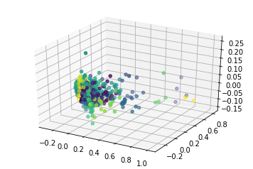


```python
for i in range(n_clusters):
    print("Group", i, ":", list(poke_names[X[pred == i]['pokedex_number'].values - 1]), "\n")
```

    Group 0 : ['Ivysaur', 'Charmeleon', 'Wartortle', 'Butterfree', 'Beedrill', 'Raticate', 'Fearow', 'Gloom', 'Parasect', 'Dugtrio', 'Persian', 'Poliwhirl', 'Kadabra', 'Weepinbell', 'Ponyta', 'Haunter', 'Tangela', 'Seadra', 'Porygon', 'Dragonair', 'Bayleef', 'Quilava', 'Croconaw', 'Furret', 'Ledian', 'Ariados', 'Togetic', 'Azumarill', 'Sunflora', 'Yanma', 'Murkrow', 'Misdreavus', 'Dunsparce', 'Qwilfish', 'Sneasel', 'Corsola', 'Grovyle', 'Combusken', 'Marshtomp', 'Mightyena', 'Linoone', 'Beautifly', 'Dustox', 'Pelipper', 'Vigoroth', 'Delcatty', 'Medicham', 'Plusle', 'Minun', 'Volbeat', 'Illumise', 'Roselia', 'Castform', 'Monferno', 'Prinplup', 'Bibarel', 'Kricketune', 'Wormadam-Plant', 'Mothim', 'Pachirisu', 'Chatot', 'Gabite', 'Rotom', 'Servine', 'Pignite', 'Dewott', 'Watchog', 'Swoobat', 'Gurdurr', 'Palpitoad', 'Archen', 'Gothorita', 'Vanillish', 'Emolga', 'Eelektrik', 'Fraxure', 'Zweilous', 'Quilladin', 'Braixen', 'Frogadier', 'Diggersby', 'Fletchinder', 'Vivillon', 'Dedenne', 'Dartrix', 'Torracat', 'Brionne', 'Gumshoos', 'Charjabug', 'Shiinotic', 'Togedemaru', 'Hakamo-o', 'Alolan-Raticate', 'Alolan-Dugtrio', 'Alolan-Persian'] 
    
    Group 1 : ['Arcanine', 'Lapras', 'Dragonite', 'Raikou', 'Entei', 'Suicune', 'Tyranitar', 'Milotic', 'Regirock', 'Regice', 'Registeel', 'Magnezone', 'Hydreigon', 'Cobalion', 'Terrakion', 'Virizion', 'Goodra', 'Zygarde', 'Volcanion', 'Necrozma', 'Mega Venusaur', 'Mega Abomasnow'] 
    
    Group 2 : ['Articuno', 'Salamence', 'Garchomp', 'Cresselia', 'Landorus', 'Genesect', 'Diancie', 'Kommo-o', 'Tapu Bulu', 'Magearna', 'Mega Charizard X', 'Mega Charizard Y', 'Mega Blastoise', 'Mega Kangaskhan', 'Mega Pinsir', 'Mega Aerodactyl', 'Mega Ampharos', 'Mega Scizor', 'Mega Heracross', 'Mega Blaziken', 'Deoxys-Defense', 'Landorus-Therian', 'Wishiwashi-School', 'Mega-Slowbro', 'Mega-Swampert', 'Mega Gallade'] 
    
    Group 3 : ['Mudsdale', 'Cosmoem', 'Celesteela', 'Guzzlord'] 
    
    Group 4 : ['Pidgeotto', 'Nidorina', 'Nidorino', 'Growlithe', 'Tentacool', "Farfetch'd", 'Drowzee', 'Staryu', 'Omanyte', 'Kabuto', 'Flaaffy', 'Skiploom', 'Aipom', 'Unown', 'Teddiursa', 'Elekid', 'Magby', 'Lombre', 'Nuzleaf', 'Loudred', 'Sableye', 'Mawile', 'Spinda', 'Vibrava', 'Cacnea', 'Lileep', 'Anorith', 'Clamperl', 'Staravia', 'Luxio', 'Cranidos', 'Buizel', 'Drifloon', 'Buneary', 'Stunky', 'Mantyke', 'Snover', 'Herdier', 'Tranquill', 'Drilbur', 'Swadloon', 'Whirlipede', 'Krokorok', 'Scraggy', 'Trubbish', 'Duosion', 'Deerling', 'Frillish', 'Elgyem', 'Lampent', 'Mienfoo', 'Pawniard', 'Rufflet', 'Vullaby', 'Larvesta', 'Litleo', 'Skiddo', 'Pancham', 'Espurr', 'Spritzee', 'Swirlix', 'Clauncher', 'Tyrunt', 'Amaura', 'Pumpkaboo', 'Trumbeak', 'Crabrawler', 'Stufful'] 
    
    Group 5 : ['Machoke', 'Graveler', 'Onix', 'Lickitung', 'Rhyhorn', 'Quagsire', 'Pupitar', 'Nosepass', 'Lairon', 'Wailmer', 'Sealeo', 'Shelgon', 'Metang', 'Grotle', 'Munchlax', 'Boldore', 'Mudbray', 'Alolan-Graveler'] 
    
    Group 6 : ['Snorlax', 'Steelix', 'Aggron', 'Wailord', 'Metagross', 'Heatran', 'Avalugg', 'Mega Aggron', 'Alolan-Exeggutor'] 
    
    Group 7 : ['Arbok', 'Nidoqueen', 'Nidoking', 'Golbat', 'Primeape', 'Dodrio', 'Kingler', 'Hitmonlee', 'Kangaskhan', 'Seaking', 'Scyther', 'Pinsir', 'Tauros', 'Kabutops', 'Aerodactyl', 'Granbull', 'Heracross', 'Piloswine', 'Stantler', 'Miltank', 'Shiftry', 'Breloom', 'Sharpedo', 'Cacturne', 'Zangoose', 'Seviper', 'Crawdaunt', 'Armaldo', 'Banette', 'Absol', 'Staraptor', 'Luxray', 'Rampardos', 'Honchkrow', 'Skuntank', 'Drapion', 'Toxicroak', 'Weavile', 'Leafeon', 'Gliscor', 'Gallade', 'Stoutland', 'Unfezant', 'Zebstrika', 'Excadrill', 'Conkeldurr', 'Throh', 'Sawk', 'Leavanny', 'Darmanitan', 'Sawsbuck', 'Mienshao', 'Bisharp', 'Braviary', 'Durant', 'Malamar', 'Trevenant', 'Toucannon', 'Lycanroc-Midday', 'Tsareena', 'Passimian', 'Komala', 'Bruxish', 'Lycanroc-Midnight', 'Lycanroc-Dusk', 'Mega-Beedrill'] 
    
    Group 8 : ['Kyogre', 'Palkia', 'Regigigas', 'Arceus', 'Reshiram', 'Zekrom', 'Kyurem', 'Mega Gyarados', 'Kyurem-White', 'Kyurem-Black', 'Hoopa-Unbound', 'Dusk Make Necrozma', 'Dawn Wings Necrozma', 'Mega-Glalie', 'Primal Kyogre', 'Mega Rayquaza'] 
    
    Group 9 : ['Pidgeot', 'Raichu', 'Ninetales', 'Venomoth', 'Alakazam', 'Victreebel', 'Tentacruel', 'Gengar', 'Electrode', 'Mr. Mime', 'Jynx', 'Electabuzz', 'Magmar', 'Jolteon', 'Xatu', 'Jumpluff', 'Espeon', 'Girafarig', 'Houndoom', 'Swellow', 'Masquerain', 'Ninjask', 'Manectric', 'Altaria', 'Chimecho', 'Roserade', 'Floatzel', 'Cherrim', 'Ambipom', 'Lopunny', 'Mismagius', 'Purugly', 'Lumineon', 'Froslass', 'Phione', 'Liepard', 'Simisage', 'Simisear', 'Simipour', 'Whimsicott', 'Lilligant', 'Basculin', 'Sigilyph', 'Cinccino', 'Swanna', 'Galvantula', 'Accelgor', 'Delphox', 'Talonflame', 'Furfrou', 'Meowstic', 'Slurpuff', 'Heliolisk', 'Hawlucha', 'Sliggoo', 'Klefki', 'Oricorio', 'Ribombee', 'Salazzle', 'Comfey', 'Mimikyu', 'Mega Medicham', 'Rotom-Heat', 'Rotom-Wash', 'Rotom-Frost', 'Rotom-Fan', 'Rotom-Mow', 'Minior-Core', 'Alolan-Raichu', 'Alolan-Ninetales'] 
    
    Group 10 : ['Venusaur', 'Charizard', 'Blastoise', 'Golduck', 'Rapidash', 'Exeggutor', 'Starmie', 'Meganium', 'Typhlosion', 'Feraligatr', 'Crobat', 'Sceptile', 'Blaziken', 'Swampert', 'Exploud', 'Flygon', 'Infernape', 'Empoleon', 'Lucario', 'Electivire', 'Magmortar', 'Yanmega', 'Serperior', 'Samurott', 'Seismitoad', 'Krookodile', 'Zoroark', 'Vanilluxe', 'Klinklang', 'Eelektross', 'Haxorus', 'Cryogonal', 'Chesnaught', 'Pyroar', 'Gogoat', 'Aegislash-Blade', 'Noivern', 'Incineroar', 'Type: Null', 'Silvally', 'Xurkitree', 'Darmanitan-Zen', 'Mega-Sharpedo'] 
    
    Group 11 : ['Pidgey', 'Rattata', 'Spearow', 'Nidoran♀', 'Nidoran♂', 'Jigglypuff', 'Zubat', 'Diglett', 'Hoothoot', 'Ledyba', 'Spinarak', 'Togepi', 'Marill', 'Hoppip', 'Slugma', 'Swinub', 'Smeargle', 'Zigzagoon', 'Taillow', 'Wingull', 'Surskit', 'Nincada', 'Shedinja', 'Whismur', 'Makuhita', 'Skitty', 'Meditite', 'Wynaut', 'Starly', 'Bidoof', 'Shinx', 'Combee', 'Riolu', 'Patrat', 'Lillipup', 'Purrloin', 'Pidove', 'Venipede', 'Cottonee', 'Tynamo', 'Bunnelby', 'Fletchling', 'Noibat', 'Pikipek', 'Yungoos', 'Rockruff', 'Dewpider', 'Fomantis', 'Wimpod', 'Alolan-Rattata', 'Alolan-Diglett'] 
    
    Group 12 : ['Golem', 'Gyarados', 'Mantine', 'Hariyama', 'Camerupt', 'Glalie', 'Torterra', 'Hippowdon', 'Rhyperior', 'Mamoswine', 'Probopass', 'Gigalith', 'Beartic', 'Golurk', 'Tyrantrum', 'Aurorus', 'Palossand', 'Turtonator', 'Dhelmise', 'Buzzwole', 'Zygarde-10%', 'Alolan-Golem', 'Mega-Camerupt'] 
    
    Group 13 : ['Sandslash', 'Marowak', 'Hitmonchan', 'Weezing', 'Sudowoodo', 'Gligar', 'Shuckle', 'Magcargo', 'Skarmory', 'Hitmontop', 'Torkoal', 'Kecleon', 'Dusclops', 'Relicanth', 'Vespiquen', 'Audino', 'Scrafty', 'Cofagrigus', 'Escavalier', 'Klang', 'Doublade', 'Carbink', 'Gourgeist', 'Toxapex', 'Araquanid', 'Pyukumuku', 'Minior-Meteor', 'Mega Mawile', 'Wormadam-Sandy', 'Wormadam-Trash', 'Aegislash-Shield', 'Alolan-Sandslash', 'Alolan-Marowak'] 
    
    Group 14 : ['Caterpie', 'Metapod', 'Weedle', 'Kakuna', 'Magikarp', 'Sentret', 'Pichu', 'Cleffa', 'Igglybuff', 'Sunkern', 'Wooper', 'Tyrogue', 'Poochyena', 'Wurmple', 'Silcoon', 'Cascoon', 'Lotad', 'Seedot', 'Ralts', 'Azurill', 'Feebas', 'Kricketot', 'Burmy', 'Happiny', 'Scatterbug', 'Spewpa', 'Wishiwashi-Solo', 'Bounsweet', 'Cosmog'] 
    
    Group 15 : ['Machamp', 'Dewgong', 'Cloyster', 'Rhydon', 'Forretress', 'Scizor', 'Ursaring', 'Kingdra', 'Donphan', 'Lunatone', 'Solrock', 'Claydol', 'Tropius', 'Walrein', 'Bastiodon', 'Bronzong', 'Spiritomb', 'Abomasnow', 'Lickilicky', 'Tangrowth', 'Dusknoir', 'Emboar', 'Scolipede', 'Crustle', 'Carracosta', 'Garbodor', 'Jellicent', 'Ferrothorn', 'Druddigon', 'Bouffalant', 'Pangoro', 'Barbaracle', 'Crabominable', 'Bewear', 'Golisopod', 'Drampa', 'Mega-Sableye'] 
    
    Group 16 : ['Zapdos', 'Moltres', 'Mew', 'Celebi', 'Latias', 'Latios', 'Jirachi', 'Deoxys-Normal', 'Porygon-Z', 'Uxie', 'Mesprit', 'Azelf', 'Manaphy', 'Darkrai', 'Shaymin', 'Victini', 'Archeops', 'Volcarona', 'Tornadus', 'Thundurus', 'Keldeo', 'Meloetta', 'Greninja', 'Floette', 'Florges', 'Hoopa', 'Tapu Koko', 'Tapu Lele', 'Tapu Fini', 'Nihilego', 'Pheromosa', 'Kartana', 'Mega Alakazam', 'Mega Gengar', 'Mega Houndoom', 'Mega Gardevoir', 'Mega Manectric', 'Mega Banette', 'Mega Absol', 'Deoxys-Attack', 'Deoxys-Speed', 'Mega Lucario', 'Shaymin-Sky', 'Tornadus-Therian', 'Thundurus-Therian', 'Meloetta-Pirouette', 'Mega-Pidgeot', 'Mega-Sceptile', 'Mega-Altaria', 'Mega Lopunny'] 
    
    Group 17 : ['Clefable', 'Vileplume', 'Poliwrath', 'Slowbro', 'Magneton', 'Muk', 'Hypno', 'Vaporeon', 'Flareon', 'Omastar', 'Noctowl', 'Ampharos', 'Bellossom', 'Politoed', 'Umbreon', 'Slowking', 'Octillery', 'Porygon2', 'Ludicolo', 'Gardevoir', 'Swalot', 'Grumpig', 'Whiscash', 'Cradily', 'Huntail', 'Gorebyss', 'Gastrodon', 'Carnivine', 'Togekiss', 'Glaceon', 'Musharna', 'Maractus', 'Gothitelle', 'Reuniclus', 'Amoonguss', 'Beheeyem', 'Chandelure', 'Stunfisk', 'Mandibuzz', 'Heatmor', 'Aromatisse', 'Dragalge', 'Clawitzer', 'Sylveon', 'Decidueye', 'Primarina', 'Vikavolt', 'Lurantis', 'Oranguru', 'Alolan-Muk', 'Mega Audino'] 
    
    Group 18 : ['Dialga', 'Giratina', 'Giratina-Origin', 'Mega-Steelix'] 
    
    Group 19 : ['Lugia', 'Ho-Oh', 'Slaking', 'Rayquaza', 'Xerneas', 'Yveltal', 'Solgaleo', 'Mega Tyranitar', 'Zygarde-Complete', 'Ultra Necrozma'] 
    
    Group 20 : ['Mewtwo', 'Lunala', 'Mega Mewtwo X', 'Mega Mewtwo Y', 'Mega Garchomp', 'Mega Salamence', 'Mega-Latias', 'Mega-Latios', 'Mega-Diancie'] 
    
    Group 21 : ['Wigglytuff', 'Chansey', 'Lanturn', 'Wobbuffet', 'Blissey', 'Drifblim', 'Alomomola'] 
    
    Group 22 : ['Sandshrew', 'Paras', 'Venonat', 'Machop', 'Geodude', 'Slowpoke', 'Doduo', 'Seel', 'Grimer', 'Shellder', 'Krabby', 'Exeggcute', 'Cubone', 'Koffing', 'Goldeen', 'Totodile', 'Pineco', 'Snubbull', 'Phanpy', 'Larvitar', 'Slakoth', 'Aron', 'Trapinch', 'Corphish', 'Duskull', 'Spheal', 'Bagon', 'Beldum', 'Turtwig', 'Shieldon', 'Bronzor', 'Bonsly', 'Gible', 'Hippopotas', 'Skorupi', 'Roggenrola', 'Timburr', 'Sewaddle', 'Darumaka', 'Dwebble', 'Yamask', 'Tirtouga', 'Ferroseed', 'Klink', 'Axew', 'Shelmet', 'Golett', 'Deino', 'Chespin', 'Honedge', 'Binacle', 'Bergmite', 'Sandygast', 'Jangmo-o', 'Alolan-Sandshrew', 'Alolan-Geodude', 'Alolan-Grimer'] 
    
    Group 23 : ['Bulbasaur', 'Charmander', 'Squirtle', 'Ekans', 'Pikachu', 'Clefairy', 'Vulpix', 'Oddish', 'Meowth', 'Psyduck', 'Mankey', 'Poliwag', 'Abra', 'Bellsprout', 'Magnemite', 'Gastly', 'Voltorb', 'Horsea', 'Ditto', 'Eevee', 'Dratini', 'Chikorita', 'Cyndaquil', 'Chinchou', 'Natu', 'Mareep', 'Remoraid', 'Delibird', 'Houndour', 'Smoochum', 'Treecko', 'Torchic', 'Mudkip', 'Kirlia', 'Shroomish', 'Electrike', 'Gulpin', 'Carvanha', 'Numel', 'Spoink', 'Swablu', 'Barboach', 'Baltoy', 'Shuppet', 'Snorunt', 'Luvdisc', 'Chimchar', 'Piplup', 'Budew', 'Cherubi', 'Shellos', 'Glameow', 'Chingling', 'Mime Jr.', 'Croagunk', 'Finneon', 'Snivy', 'Tepig', 'Oshawott', 'Pansage', 'Pansear', 'Panpour', 'Munna', 'Blitzle', 'Woobat', 'Tympole', 'Petilil', 'Sandile', 'Zorua', 'Minccino', 'Gothita', 'Solosis', 'Ducklett', 'Vanillite', 'Karrablast', 'Foongus', 'Joltik', 'Litwick', 'Cubchoo', 'Fennekin', 'Froakie', 'Flabébé', 'Inkay', 'Skrelp', 'Helioptile', 'Goomy', 'Phantump', 'Rowlet', 'Litten', 'Popplio', 'Grubbin', 'Cutiefly', 'Mareanie', 'Morelull', 'Salandit', 'Steenee', 'Alolan-Vulpix', 'Alolan-Meowth'] 
    
    Group 24 : ['Groudon', 'Mega Metagross', 'Primal Groudon'] 
    
    


```python
X2 = X.copy(deep=True)
X2["pokedex_number"]=poke_names

# Example group: edit number to see different group
X2[pred==6]
```


<div>

<table border="1" class="dataframe">
  <thead>
    <tr style="text-align: right;">
      <th></th>
      <th>pokedex_number</th>
      <th>hp</th>
      <th>attack</th>
      <th>defense</th>
      <th>sp_attack</th>
      <th>sp_defense</th>
      <th>speed</th>
      <th>base_total</th>
      <th>height_m</th>
      <th>weight_kg</th>
      <th>weakness</th>
    </tr>
  </thead>
  <tbody>
    <tr>
      <th>142</th>
      <td>Snorlax</td>
      <td>160</td>
      <td>110</td>
      <td>65</td>
      <td>65</td>
      <td>110</td>
      <td>30</td>
      <td>540</td>
      <td>2.1</td>
      <td>460.0</td>
      <td>18.00</td>
    </tr>
    <tr>
      <th>207</th>
      <td>Steelix</td>
      <td>75</td>
      <td>85</td>
      <td>200</td>
      <td>55</td>
      <td>65</td>
      <td>30</td>
      <td>510</td>
      <td>9.2</td>
      <td>400.0</td>
      <td>15.75</td>
    </tr>
    <tr>
      <th>305</th>
      <td>Aggron</td>
      <td>70</td>
      <td>110</td>
      <td>180</td>
      <td>60</td>
      <td>60</td>
      <td>50</td>
      <td>530</td>
      <td>2.1</td>
      <td>360.0</td>
      <td>19.50</td>
    </tr>
    <tr>
      <th>320</th>
      <td>Wailord</td>
      <td>170</td>
      <td>90</td>
      <td>45</td>
      <td>90</td>
      <td>45</td>
      <td>60</td>
      <td>500</td>
      <td>14.5</td>
      <td>398.0</td>
      <td>18.00</td>
    </tr>
    <tr>
      <th>475</th>
      <td>Probopass</td>
      <td>60</td>
      <td>55</td>
      <td>145</td>
      <td>75</td>
      <td>150</td>
      <td>40</td>
      <td>525</td>
      <td>1.4</td>
      <td>340.0</td>
      <td>19.50</td>
    </tr>
    <tr>
      <th>484</th>
      <td>Heatran</td>
      <td>91</td>
      <td>90</td>
      <td>106</td>
      <td>130</td>
      <td>106</td>
      <td>77</td>
      <td>600</td>
      <td>1.7</td>
      <td>430.0</td>
      <td>16.25</td>
    </tr>
    <tr>
      <th>712</th>
      <td>Avalugg</td>
      <td>95</td>
      <td>117</td>
      <td>184</td>
      <td>44</td>
      <td>46</td>
      <td>28</td>
      <td>514</td>
      <td>2.0</td>
      <td>505.0</td>
      <td>21.50</td>
    </tr>
    <tr>
      <th>821</th>
      <td>Mega Aggron</td>
      <td>70</td>
      <td>140</td>
      <td>230</td>
      <td>60</td>
      <td>80</td>
      <td>50</td>
      <td>630</td>
      <td>2.2</td>
      <td>395.0</td>
      <td>15.00</td>
    </tr>
    <tr>
      <th>875</th>
      <td>Alolan-Exeggutor</td>
      <td>95</td>
      <td>105</td>
      <td>85</td>
      <td>125</td>
      <td>75</td>
      <td>45</td>
      <td>530</td>
      <td>10.9</td>
      <td>415.6</td>
      <td>25.25</td>
    </tr>
  </tbody>
</table>
</div>


# Spectral Clustering

A different method of unsupervised grouping
Editable parameters:
* n_clusters
* random_state

```python
from sklearn.cluster import SpectralClustering

pca = PCA(n_components=3)
n_clusters = 25
X = df[stats]
spec_clust = SpectralClustering(n_clusters=n_clusters, affinity='nearest_neighbors', random_state=5).fit(X[stats[1:]])
pred = spec_clust.labels_

pca.fit(X[stats[1:]]) 
X_pca = pca.transform(X[stats[1:]])
X_pca = X_pca - np.mean(X_pca)
X_pca = X_pca / np.max(X_pca)

from mpl_toolkits.mplot3d import Axes3D
fig = plt.figure()
ax = fig.add_subplot(111, projection='3d')
ax.scatter(xs=X_pca[:,0], ys=X_pca[:,1], zs=X_pca[:,2], c=pred)
```


    <mpl_toolkits.mplot3d.art3d.Path3DCollection at 0x20b75784ac8>


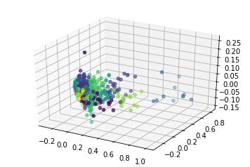


```python
for i in range(n_clusters):
    print("Group", i, ":", list(poke_names[X[pred == i]['pokedex_number'].values - 1]), "\n")
```

    Group 0 : ['Pidgeot', 'Raichu', 'Venomoth', 'Victreebel', 'Gengar', 'Seadra', 'Mr. Mime', 'Jynx', 'Electabuzz', 'Magmar', 'Xatu', 'Jumpluff', 'Misdreavus', 'Girafarig', 'Houndoom', 'Pelipper', 'Masquerain', 'Manectric', 'Altaria', 'Chimecho', 'Floatzel', 'Cherrim', 'Lopunny', 'Toxicroak', 'Lumineon', 'Froslass', 'Rotom', 'Phione', 'Simisage', 'Simisear', 'Simipour', 'Whimsicott', 'Lilligant', 'Basculin', 'Swanna', 'Galvantula', 'Accelgor', 'Talonflame', 'Furfrou', 'Meowstic', 'Heliolisk', 'Hawlucha', 'Sliggoo', 'Klefki', 'Oricorio', 'Ribombee', 'Salazzle', 'Mimikyu', 'Minior-Core', 'Alolan-Raichu', 'Alolan-Ninetales'] 
    
    Group 1 : ['Mewtwo', 'Slaking', 'Rayquaza', 'Xerneas', 'Yveltal', 'Solgaleo', 'Lunala', 'Mega Charizard X', 'Mega Charizard Y', 'Mega Blastoise', 'Mega Mewtwo X', 'Mega Mewtwo Y', 'Mega Garchomp', 'Ultra Necrozma', 'Mega-Swampert', 'Mega Salamence', 'Mega-Latias', 'Mega-Latios', 'Mega-Diancie'] 
    
    Group 2 : ['Venusaur', 'Charizard', 'Blastoise', 'Nidoking', 'Golduck', 'Tentacruel', 'Rapidash', 'Electrode', 'Starmie', 'Flareon', 'Meganium', 'Typhlosion', 'Feraligatr', 'Crobat', 'Sceptile', 'Blaziken', 'Swampert', 'Exploud', 'Flygon', 'Infernape', 'Empoleon', 'Luxray', 'Honchkrow', 'Lucario', 'Magmortar', 'Yanmega', 'Porygon-Z', 'Serperior', 'Samurott', 'Zebstrika', 'Seismitoad', 'Krookodile', 'Zoroark', 'Vanilluxe', 'Klinklang', 'Eelektross', 'Mienshao', 'Pyroar', 'Gogoat', 'Aegislash-Blade', 'Noivern', 'Decidueye', 'Incineroar', 'Silvally', 'Mega Banette', 'Darmanitan-Zen'] 
    
    Group 3 : ['Bulbasaur', 'Squirtle', 'Clefairy', 'Oddish', 'Paras', 'Venonat', 'Machop', 'Slowpoke', 'Magnemite', 'Seel', 'Grimer', 'Drowzee', 'Exeggcute', 'Cubone', 'Koffing', 'Omanyte', 'Chikorita', 'Totodile', 'Snubbull', 'Teddiursa', 'Phanpy', 'Larvitar', 'Torchic', 'Mudkip', 'Lombre', 'Shroomish', 'Slakoth', 'Aron', 'Gulpin', 'Numel', 'Trapinch', 'Swablu', 'Corphish', 'Baltoy', 'Lileep', 'Duskull', 'Wynaut', 'Snorunt', 'Spheal', 'Clamperl', 'Bagon', 'Beldum', 'Turtwig', 'Piplup', 'Shieldon', 'Shellos', 'Bronzor', 'Gible', 'Hippopotas', 'Skorupi', 'Mantyke', 'Snover', 'Tepig', 'Oshawott', 'Timburr', 'Sewaddle', 'Whirlipede', 'Darumaka', 'Yamask', 'Tirtouga', 'Ducklett', 'Vanillite', 'Foongus', 'Frillish', 'Ferroseed', 'Klink', 'Elgyem', 'Cubchoo', 'Shelmet', 'Golett', 'Deino', 'Chespin', 'Spritzee', 'Swirlix', 'Binacle', 'Skrelp', 'Clauncher', 'Phantump', 'Pumpkaboo', 'Bergmite', 'Rowlet', 'Popplio', 'Grubbin', 'Mareanie', 'Sandygast', 'Jangmo-o', 'Alolan-Grimer'] 
    
    Group 4 : ['Wartortle', 'Gloom', 'Parasect', 'Marowak', 'Tangela', 'Porygon', 'Bayleef', 'Croconaw', 'Ariados', 'Togetic', 'Azumarill', 'Sudowoodo', 'Sunflora', 'Dunsparce', 'Shuckle', 'Magcargo', 'Corsola', 'Marshtomp', 'Dustox', 'Sableye', 'Mawile', 'Kecleon', 'Dusclops', 'Prinplup', 'Wormadam-Plant', 'Gurdurr', 'Swadloon', 'Gothorita', 'Klang', 'Eelektrik', 'Quilladin', 'Doublade', 'Dartrix', 'Brionne', 'Gumshoos', 'Charjabug', 'Shiinotic', 'Pyukumuku', 'Minior-Meteor', 'Hakamo-o', 'Wormadam-Sandy', 'Wormadam-Trash', 'Alolan-Sandslash', 'Alolan-Marowak'] 
    
    Group 5 : ['Golem', 'Gyarados', 'Snorlax', 'Steelix', 'Hariyama', 'Aggron', 'Wailord', 'Glalie', 'Torterra', 'Hippowdon', 'Rhyperior', 'Mamoswine', 'Probopass', 'Gigalith', 'Beartic', 'Golurk', 'Tyrantrum', 'Avalugg', 'Zygarde', 'Palossand', 'Buzzwole', 'Mega Aggron', 'Zygarde-10%', 'Alolan-Golem', 'Alolan-Exeggutor', 'Mega-Camerupt', 'Mega-Glalie'] 
    
    Group 6 : ['Sandslash', 'Nidoqueen', 'Poliwrath', 'Dodrio', 'Muk', 'Kingler', 'Kangaskhan', 'Scyther', 'Pinsir', 'Tauros', 'Kabutops', 'Aerodactyl', 'Umbreon', 'Granbull', 'Heracross', 'Piloswine', 'Skarmory', 'Stantler', 'Hitmontop', 'Miltank', 'Shiftry', 'Breloom', 'Sharpedo', 'Cacturne', 'Zangoose', 'Seviper', 'Crawdaunt', 'Armaldo', 'Banette', 'Absol', 'Relicanth', 'Staraptor', 'Ambipom', 'Skuntank', 'Drapion', 'Weavile', 'Leafeon', 'Gliscor', 'Gallade', 'Stoutland', 'Unfezant', 'Excadrill', 'Throh', 'Sawk', 'Leavanny', 'Darmanitan', 'Scrafty', 'Cinccino', 'Sawsbuck', 'Escavalier', 'Bisharp', 'Braviary', 'Mandibuzz', 'Heatmor', 'Durant', 'Malamar', 'Carbink', 'Trevenant', 'Gourgeist', 'Toucannon', 'Lycanroc-Midday', 'Toxapex', 'Tsareena', 'Passimian', 'Komala', 'Bruxish', 'Mega Mawile', 'Mega Medicham', 'Aegislash-Shield', 'Lycanroc-Midnight', 'Lycanroc-Dusk', 'Alolan-Muk', 'Mega-Beedrill'] 
    
    Group 7 : ['Sandshrew', 'Geodude', 'Shellder', 'Krabby', 'Pineco', 'Nincada', 'Bonsly', 'Roggenrola', 'Dwebble', 'Honedge', 'Alolan-Sandshrew', 'Alolan-Geodude'] 
    
    Group 8 : ['Pidgey', 'Rattata', 'Spearow', 'Zubat', 'Diglett', 'Hoothoot', 'Spinarak', 'Marill', 'Hoppip', 'Swinub', 'Smeargle', 'Zigzagoon', 'Taillow', 'Shedinja', 'Whismur', 'Makuhita', 'Skitty', 'Starly', 'Bidoof', 'Shinx', 'Combee', 'Patrat', 'Pidove', 'Venipede', 'Bunnelby', 'Noibat', 'Pikipek', 'Yungoos', 'Fomantis', 'Wimpod', 'Alolan-Rattata', 'Alolan-Diglett'] 
    
    Group 9 : ['Groudon', 'Dialga', 'Giratina', 'Mudsdale', 'Cosmoem', 'Celesteela', 'Guzzlord', 'Giratina-Origin', 'Mega-Steelix', 'Mega Metagross', 'Primal Groudon'] 
    
    Group 10 : ['Mew', 'Celebi', 'Jirachi', 'Uxie', 'Mesprit', 'Azelf', 'Manaphy', 'Shaymin', 'Victini', 'Meloetta', 'Diancie', 'Hoopa', 'Tapu Fini', 'Shaymin-Sky', 'Meloetta-Pirouette', 'Wishiwashi-School', 'Mega-Altaria'] 
    
    Group 11 : ['Caterpie', 'Metapod', 'Weedle', 'Kakuna', 'Magikarp', 'Sentret', 'Pichu', 'Cleffa', 'Igglybuff', 'Sunkern', 'Wooper', 'Tyrogue', 'Poochyena', 'Wurmple', 'Silcoon', 'Cascoon', 'Lotad', 'Seedot', 'Ralts', 'Azurill', 'Feebas', 'Kricketot', 'Burmy', 'Happiny', 'Scatterbug', 'Spewpa', 'Wishiwashi-Solo', 'Bounsweet', 'Cosmog'] 
    
    Group 12 : ['Arcanine', 'Lapras', 'Dragonite', 'Kingdra', 'Raikou', 'Entei', 'Suicune', 'Tyranitar', 'Lugia', 'Ho-Oh', 'Milotic', 'Regirock', 'Regice', 'Registeel', 'Magnezone', 'Hydreigon', 'Cobalion', 'Terrakion', 'Virizion', 'Goodra', 'Volcanion', 'Necrozma', 'Mega Venusaur', 'Mega Abomasnow'] 
    
    Group 13 : ['Pidgeotto', 'Nidorina', 'Nidorino', 'Growlithe', 'Poliwhirl', "Farfetch'd", 'Goldeen', 'Kabuto', 'Flaaffy', 'Aipom', 'Elekid', 'Magby', 'Nuzleaf', 'Loudred', 'Spinda', 'Vibrava', 'Cacnea', 'Anorith', 'Staravia', 'Kricketune', 'Luxio', 'Cranidos', 'Buizel', 'Drifloon', 'Buneary', 'Stunky', 'Herdier', 'Tranquill', 'Drilbur', 'Palpitoad', 'Krokorok', 'Scraggy', 'Deerling', 'Lampent', 'Mienfoo', 'Pawniard', 'Rufflet', 'Vullaby', 'Larvesta', 'Fletchinder', 'Litleo', 'Skiddo', 'Pancham', 'Espurr', 'Tyrunt', 'Amaura', 'Trumbeak', 'Crabrawler', 'Stufful'] 
    
    Group 14 : ['Jigglypuff', 'Ledyba', 'Togepi', 'Mareep', 'Slugma', 'Kirlia', 'Budew', 'Cherubi', 'Chingling', 'Munna', 'Petilil', 'Gothita', 'Solosis', 'Litwick', 'Flabébé', 'Goomy', 'Dewpider', 'Morelull'] 
    
    Group 15 : ['Machoke', 'Graveler', 'Onix', 'Lickitung', 'Rhyhorn', 'Quagsire', 'Pupitar', 'Nosepass', 'Lairon', 'Wailmer', 'Sealeo', 'Shelgon', 'Grotle', 'Munchlax', 'Boldore', 'Mudbray', 'Alolan-Graveler'] 
    
    Group 16 : ['Articuno', 'Zapdos', 'Moltres', 'Salamence', 'Latias', 'Latios', 'Deoxys-Normal', 'Garchomp', 'Cresselia', 'Darkrai', 'Archeops', 'Tornadus', 'Thundurus', 'Landorus', 'Keldeo', 'Genesect', 'Greninja', 'Kommo-o', 'Tapu Koko', 'Tapu Lele', 'Tapu Bulu', 'Nihilego', 'Pheromosa', 'Xurkitree', 'Kartana', 'Magearna', 'Mega Alakazam', 'Mega Gengar', 'Mega Kangaskhan', 'Mega Pinsir', 'Mega Aerodactyl', 'Mega Ampharos', 'Mega Scizor', 'Mega Heracross', 'Mega Houndoom', 'Mega Blaziken', 'Mega Gardevoir', 'Mega Manectric', 'Mega Absol', 'Deoxys-Attack', 'Deoxys-Defense', 'Deoxys-Speed', 'Mega Lucario', 'Tornadus-Therian', 'Thundurus-Therian', 'Landorus-Therian', 'Mega-Pidgeot', 'Mega-Slowbro', 'Mega-Sceptile', 'Mega Lopunny', 'Mega Gallade'] 
    
    Group 17 : ['Charmander', 'Pikachu', 'Vulpix', 'Psyduck', 'Abra', 'Tentacool', 'Gastly', 'Voltorb', 'Horsea', 'Staryu', 'Eevee', 'Cyndaquil', 'Chinchou', 'Natu', 'Skiploom', 'Unown', 'Delibird', 'Houndour', 'Smoochum', 'Treecko', 'Spoink', 'Luvdisc', 'Chimchar', 'Mime Jr.', 'Finneon', 'Snivy', 'Pansage', 'Pansear', 'Panpour', 'Woobat', 'Trubbish', 'Zorua', 'Joltik', 'Fennekin', 'Froakie', 'Litten', 'Salandit', 'Alolan-Vulpix'] 
    
    Group 18 : ['Machamp', 'Dewgong', 'Cloyster', 'Exeggutor', 'Rhydon', 'Forretress', 'Scizor', 'Ursaring', 'Mantine', 'Donphan', 'Swalot', 'Camerupt', 'Torkoal', 'Lunatone', 'Solrock', 'Claydol', 'Tropius', 'Walrein', 'Metang', 'Rampardos', 'Bastiodon', 'Bronzong', 'Spiritomb', 'Abomasnow', 'Lickilicky', 'Tangrowth', 'Electivire', 'Dusknoir', 'Emboar', 'Conkeldurr', 'Scolipede', 'Crustle', 'Carracosta', 'Garbodor', 'Jellicent', 'Ferrothorn', 'Haxorus', 'Cryogonal', 'Druddigon', 'Bouffalant', 'Chesnaught', 'Pangoro', 'Barbaracle', 'Aurorus', 'Crabominable', 'Bewear', 'Golisopod', 'Type: Null', 'Turtonator', 'Drampa', 'Dhelmise', 'Mega-Sableye', 'Mega-Sharpedo'] 
    
    Group 19 : ['Clefable', 'Wigglytuff', 'Vileplume', 'Slowbro', 'Magneton', 'Hypno', 'Weezing', 'Chansey', 'Vaporeon', 'Omastar', 'Noctowl', 'Lanturn', 'Ampharos', 'Bellossom', 'Politoed', 'Slowking', 'Wobbuffet', 'Octillery', 'Porygon2', 'Blissey', 'Ludicolo', 'Grumpig', 'Whiscash', 'Cradily', 'Huntail', 'Gorebyss', 'Vespiquen', 'Gastrodon', 'Drifblim', 'Carnivine', 'Musharna', 'Audino', 'Maractus', 'Cofagrigus', 'Gothitelle', 'Reuniclus', 'Amoonguss', 'Alomomola', 'Beheeyem', 'Stunfisk', 'Aromatisse', 'Slurpuff', 'Dragalge', 'Clawitzer', 'Vikavolt', 'Araquanid', 'Lurantis', 'Oranguru', 'Mega Audino'] 
    
    Group 20 : ['Metagross', 'Kyogre', 'Palkia', 'Heatran', 'Regigigas', 'Arceus', 'Reshiram', 'Zekrom', 'Kyurem', 'Mega Gyarados', 'Mega Tyranitar', 'Kyurem-White', 'Kyurem-Black', 'Zygarde-Complete', 'Hoopa-Unbound', 'Dusk Make Necrozma', 'Dawn Wings Necrozma', 'Primal Kyogre', 'Mega Rayquaza'] 
    
    Group 21 : ['Beedrill', 'Raticate', 'Fearow', 'Arbok', 'Golbat', 'Dugtrio', 'Persian', 'Primeape', 'Ponyta', 'Hitmonlee', 'Hitmonchan', 'Seaking', 'Furret', 'Gligar', 'Qwilfish', 'Sneasel', 'Mightyena', 'Linoone', 'Swellow', 'Vigoroth', 'Ninjask', 'Delcatty', 'Medicham', 'Volbeat', 'Illumise', 'Bibarel', 'Pachirisu', 'Purugly', 'Gabite', 'Servine', 'Pignite', 'Watchog', 'Liepard', 'Emolga', 'Fraxure', 'Zweilous', 'Diggersby', 'Togedemaru', 'Alolan-Raticate', 'Alolan-Dugtrio', 'Alolan-Persian'] 
    
    Group 22 : ['Ninetales', 'Alakazam', 'Jolteon', 'Espeon', 'Gardevoir', 'Roserade', 'Mismagius', 'Togekiss', 'Glaceon', 'Sigilyph', 'Chandelure', 'Volcarona', 'Delphox', 'Floette', 'Florges', 'Sylveon', 'Primarina', 'Comfey', 'Rotom-Heat', 'Rotom-Wash', 'Rotom-Frost', 'Rotom-Fan', 'Rotom-Mow'] 
    
    Group 23 : ['Ekans', 'Nidoran♀', 'Nidoran♂', 'Meowth', 'Mankey', 'Poliwag', 'Bellsprout', 'Doduo', 'Ditto', 'Dratini', 'Remoraid', 'Wingull', 'Surskit', 'Meditite', 'Electrike', 'Carvanha', 'Barboach', 'Shuppet', 'Glameow', 'Riolu', 'Croagunk', 'Lillipup', 'Purrloin', 'Blitzle', 'Tympole', 'Cottonee', 'Sandile', 'Minccino', 'Karrablast', 'Tynamo', 'Axew', 'Fletchling', 'Inkay', 'Helioptile', 'Cutiefly', 'Rockruff', 'Steenee', 'Alolan-Meowth'] 
    
    Group 24 : ['Ivysaur', 'Charmeleon', 'Butterfree', 'Kadabra', 'Weepinbell', 'Haunter', 'Dragonair', 'Quilava', 'Ledian', 'Yanma', 'Murkrow', 'Grovyle', 'Combusken', 'Beautifly', 'Plusle', 'Minun', 'Roselia', 'Castform', 'Monferno', 'Mothim', 'Chatot', 'Dewott', 'Swoobat', 'Archen', 'Duosion', 'Vanillish', 'Braixen', 'Frogadier', 'Vivillon', 'Dedenne', 'Torracat'] 
    
    


```python
# Example group: edit number to see different group
X2[pred==5]
```


<div>

<table border="1" class="dataframe">
  <thead>
    <tr style="text-align: right;">
      <th></th>
      <th>pokedex_number</th>
      <th>hp</th>
      <th>attack</th>
      <th>defense</th>
      <th>sp_attack</th>
      <th>sp_defense</th>
      <th>speed</th>
      <th>base_total</th>
      <th>height_m</th>
      <th>weight_kg</th>
      <th>weakness</th>
    </tr>
  </thead>
  <tbody>
    <tr>
      <th>75</th>
      <td>Golem</td>
      <td>80</td>
      <td>110</td>
      <td>130</td>
      <td>55</td>
      <td>65</td>
      <td>45</td>
      <td>485</td>
      <td>1.4</td>
      <td>300.0</td>
      <td>24.25</td>
    </tr>
    <tr>
      <th>129</th>
      <td>Gyarados</td>
      <td>95</td>
      <td>125</td>
      <td>79</td>
      <td>60</td>
      <td>100</td>
      <td>81</td>
      <td>540</td>
      <td>6.5</td>
      <td>235.0</td>
      <td>18.50</td>
    </tr>
    <tr>
      <th>142</th>
      <td>Snorlax</td>
      <td>160</td>
      <td>110</td>
      <td>65</td>
      <td>65</td>
      <td>110</td>
      <td>30</td>
      <td>540</td>
      <td>2.1</td>
      <td>460.0</td>
      <td>18.00</td>
    </tr>
    <tr>
      <th>207</th>
      <td>Steelix</td>
      <td>75</td>
      <td>85</td>
      <td>200</td>
      <td>55</td>
      <td>65</td>
      <td>30</td>
      <td>510</td>
      <td>9.2</td>
      <td>400.0</td>
      <td>15.75</td>
    </tr>
    <tr>
      <th>296</th>
      <td>Hariyama</td>
      <td>144</td>
      <td>120</td>
      <td>60</td>
      <td>40</td>
      <td>60</td>
      <td>50</td>
      <td>474</td>
      <td>2.3</td>
      <td>253.8</td>
      <td>19.50</td>
    </tr>
    <tr>
      <th>305</th>
      <td>Aggron</td>
      <td>70</td>
      <td>110</td>
      <td>180</td>
      <td>60</td>
      <td>60</td>
      <td>50</td>
      <td>530</td>
      <td>2.1</td>
      <td>360.0</td>
      <td>19.50</td>
    </tr>
    <tr>
      <th>320</th>
      <td>Wailord</td>
      <td>170</td>
      <td>90</td>
      <td>45</td>
      <td>90</td>
      <td>45</td>
      <td>60</td>
      <td>500</td>
      <td>14.5</td>
      <td>398.0</td>
      <td>18.00</td>
    </tr>
    <tr>
      <th>361</th>
      <td>Glalie</td>
      <td>80</td>
      <td>80</td>
      <td>80</td>
      <td>80</td>
      <td>80</td>
      <td>80</td>
      <td>480</td>
      <td>1.5</td>
      <td>256.5</td>
      <td>21.50</td>
    </tr>
    <tr>
      <th>388</th>
      <td>Torterra</td>
      <td>95</td>
      <td>109</td>
      <td>105</td>
      <td>75</td>
      <td>85</td>
      <td>56</td>
      <td>525</td>
      <td>2.2</td>
      <td>310.0</td>
      <td>22.00</td>
    </tr>
    <tr>
      <th>449</th>
      <td>Hippowdon</td>
      <td>108</td>
      <td>112</td>
      <td>118</td>
      <td>68</td>
      <td>72</td>
      <td>47</td>
      <td>525</td>
      <td>2.0</td>
      <td>300.0</td>
      <td>19.00</td>
    </tr>
    <tr>
      <th>463</th>
      <td>Rhyperior</td>
      <td>115</td>
      <td>140</td>
      <td>130</td>
      <td>55</td>
      <td>55</td>
      <td>40</td>
      <td>535</td>
      <td>2.4</td>
      <td>282.8</td>
      <td>24.25</td>
    </tr>
    <tr>
      <th>472</th>
      <td>Mamoswine</td>
      <td>110</td>
      <td>130</td>
      <td>80</td>
      <td>70</td>
      <td>60</td>
      <td>80</td>
      <td>530</td>
      <td>2.5</td>
      <td>291.0</td>
      <td>21.50</td>
    </tr>
    <tr>
      <th>475</th>
      <td>Probopass</td>
      <td>60</td>
      <td>55</td>
      <td>145</td>
      <td>75</td>
      <td>150</td>
      <td>40</td>
      <td>525</td>
      <td>1.4</td>
      <td>340.0</td>
      <td>19.50</td>
    </tr>
    <tr>
      <th>525</th>
      <td>Gigalith</td>
      <td>85</td>
      <td>135</td>
      <td>130</td>
      <td>60</td>
      <td>80</td>
      <td>25</td>
      <td>515</td>
      <td>1.7</td>
      <td>260.0</td>
      <td>21.00</td>
    </tr>
    <tr>
      <th>613</th>
      <td>Beartic</td>
      <td>95</td>
      <td>130</td>
      <td>80</td>
      <td>70</td>
      <td>80</td>
      <td>50</td>
      <td>505</td>
      <td>2.6</td>
      <td>260.0</td>
      <td>21.50</td>
    </tr>
    <tr>
      <th>622</th>
      <td>Golurk</td>
      <td>89</td>
      <td>124</td>
      <td>80</td>
      <td>55</td>
      <td>80</td>
      <td>55</td>
      <td>483</td>
      <td>2.8</td>
      <td>330.0</td>
      <td>18.25</td>
    </tr>
    <tr>
      <th>696</th>
      <td>Tyrantrum</td>
      <td>82</td>
      <td>121</td>
      <td>119</td>
      <td>69</td>
      <td>59</td>
      <td>71</td>
      <td>521</td>
      <td>2.5</td>
      <td>270.0</td>
      <td>21.25</td>
    </tr>
    <tr>
      <th>712</th>
      <td>Avalugg</td>
      <td>95</td>
      <td>117</td>
      <td>184</td>
      <td>44</td>
      <td>46</td>
      <td>28</td>
      <td>514</td>
      <td>2.0</td>
      <td>505.0</td>
      <td>21.50</td>
    </tr>
    <tr>
      <th>717</th>
      <td>Zygarde</td>
      <td>108</td>
      <td>100</td>
      <td>121</td>
      <td>81</td>
      <td>95</td>
      <td>85</td>
      <td>600</td>
      <td>5.0</td>
      <td>284.6</td>
      <td>20.50</td>
    </tr>
    <tr>
      <th>769</th>
      <td>Palossand</td>
      <td>85</td>
      <td>75</td>
      <td>110</td>
      <td>100</td>
      <td>75</td>
      <td>35</td>
      <td>480</td>
      <td>1.3</td>
      <td>250.0</td>
      <td>18.25</td>
    </tr>
    <tr>
      <th>793</th>
      <td>Buzzwole</td>
      <td>107</td>
      <td>139</td>
      <td>139</td>
      <td>53</td>
      <td>53</td>
      <td>79</td>
      <td>570</td>
      <td>2.4</td>
      <td>333.6</td>
      <td>21.50</td>
    </tr>
    <tr>
      <th>821</th>
      <td>Mega Aggron</td>
      <td>70</td>
      <td>140</td>
      <td>230</td>
      <td>60</td>
      <td>80</td>
      <td>50</td>
      <td>630</td>
      <td>2.2</td>
      <td>395.0</td>
      <td>15.00</td>
    </tr>
    <tr>
      <th>849</th>
      <td>Zygarde-10%</td>
      <td>54</td>
      <td>100</td>
      <td>71</td>
      <td>61</td>
      <td>85</td>
      <td>115</td>
      <td>486</td>
      <td>5.0</td>
      <td>284.6</td>
      <td>20.50</td>
    </tr>
    <tr>
      <th>872</th>
      <td>Alolan-Golem</td>
      <td>80</td>
      <td>120</td>
      <td>130</td>
      <td>55</td>
      <td>65</td>
      <td>45</td>
      <td>495</td>
      <td>1.7</td>
      <td>316.0</td>
      <td>21.25</td>
    </tr>
    <tr>
      <th>875</th>
      <td>Alolan-Exeggutor</td>
      <td>95</td>
      <td>105</td>
      <td>85</td>
      <td>125</td>
      <td>75</td>
      <td>45</td>
      <td>530</td>
      <td>10.9</td>
      <td>415.6</td>
      <td>25.25</td>
    </tr>
    <tr>
      <th>885</th>
      <td>Mega-Camerupt</td>
      <td>70</td>
      <td>120</td>
      <td>100</td>
      <td>145</td>
      <td>105</td>
      <td>20</td>
      <td>560</td>
      <td>2.5</td>
      <td>320.5</td>
      <td>18.50</td>
    </tr>
    <tr>
      <th>887</th>
      <td>Mega-Glalie</td>
      <td>80</td>
      <td>120</td>
      <td>80</td>
      <td>120</td>
      <td>80</td>
      <td>100</td>
      <td>580</td>
      <td>2.1</td>
      <td>350.2</td>
      <td>21.50</td>
    </tr>
  </tbody>
</table>
</div>


# BINARY CLASSIFICATION: 

Trying different methods of predicting if a Pokemon is legendary


```python
from sklearn.metrics import confusion_matrix
from sklearn.utils.multiclass import unique_labels
from sklearn.model_selection import train_test_split
from sklearn.metrics import accuracy_score

# https://scikit-learn.org/stable/auto_examples/model_selection/plot_confusion_matrix.html
def plot_confusion_matrix(y_true, y_pred, classes,
                          normalize=False,
                          title=None,
                          cmap=plt.cm.Blues):
    """
    This function prints and plots the confusion matrix.
    Normalization can be applied by setting `normalize=True`.
    """
    if not title:
        if normalize:
            title = 'Normalized confusion matrix'
        else:
            title = 'Confusion matrix, without normalization'

    # Compute confusion matrix
    cm = confusion_matrix(y_true, y_pred)
    # Only use the labels that appear in the data
    classes = classes[unique_labels(y_true, y_pred)]
    if normalize:
        cm = cm.astype('float') / cm.sum(axis=1)[:, np.newaxis]
        print("Normalized confusion matrix")
    else:
        print('Confusion matrix, without normalization')

    print(cm)

    fig, ax = plt.subplots()
    im = ax.imshow(cm, interpolation='nearest', cmap=cmap)
    ax.figure.colorbar(im, ax=ax)
    # We want to show all ticks...
    ax.set(xticks=np.arange(cm.shape[1]),
           yticks=np.arange(cm.shape[0]),
           # ... and label them with the respective list entries
           xticklabels=classes, yticklabels=classes,
           title=title,
           ylabel='True label',
           xlabel='Predicted label')

    # Rotate the tick labels and set their alignment.
    plt.setp(ax.get_xticklabels(), rotation=45, ha="right",
             rotation_mode="anchor")

    # Loop over data dimensions and create text annotations.
    fmt = '.2f' if normalize else 'd'
    thresh = cm.max() / 2.
    for i in range(cm.shape[0]):
        for j in range(cm.shape[1]):
            ax.text(j, i, format(cm[i, j], fmt),
                    ha="center", va="center",
                    color="white" if cm[i, j] > thresh else "black")
    fig.tight_layout()
    return ax

```


```python
def print_misclass(X, y_true, y_pred):
    #match_names = poke_names[X[:,10]-1].values
    miss = X[:,10][y_true != y_pred]
    for i in miss:
        i = int(i)
        if i not in y_true:
            print(poke_names[i-1] + " is not a legendary.")
        else:
            print(poke_names[i-1] + " is a legendary.")
```

# Standard SVM


```python
design_matrix = df.values.astype(np.float32)
X_train, X_test, y_train, y_test = train_test_split(
    design_matrix, legendary_labels, test_size = 0.15, random_state = 200)
```


```python
from sklearn.svm import LinearSVC

X2_train, X_val, y2_train, y_val = train_test_split(
    X_train, y_train, test_size = 0.15, random_state = 0)

# Line search for best C parameter; judge by confusion matrix performance
max_acc = 0
searched_C = -1
for c in np.logspace(-10, 10, 25):
    clf = LinearSVC(random_state=0, tol=1e-4, C = c, max_iter=10000)
    clf.fit(X2_train, y2_train)
    pred_val = clf.predict(X_val)
    cm = confusion_matrix(y_val, pred_val)
    cm = cm.astype('float') / cm.sum(axis=1)[:, np.newaxis]
    val_acc = cm[0][0]+cm[1][1]
    if val_acc > max_acc:
        max_acc=val_acc
        searched_C=c
        plot_confusion_matrix(y_val, pred_val, np.array(['Not Legendary', 'Legendary']), normalize=True)
```

    Normalized confusion matrix
    [[0.99038462 0.00961538]
     [0.18181818 0.81818182]]
    

    D:\Anaconda\lib\site-packages\sklearn\svm\base.py:929: ConvergenceWarning: Liblinear failed to converge, increase the number of iterations.
      "the number of iterations.", ConvergenceWarning)
    

    Normalized confusion matrix
    [[0.99038462 0.00961538]
     [0.09090909 0.90909091]]
    

    D:\Anaconda\lib\site-packages\sklearn\svm\base.py:929: ConvergenceWarning: Liblinear failed to converge, increase the number of iterations.
      "the number of iterations.", ConvergenceWarning)
    D:\Anaconda\lib\site-packages\sklearn\svm\base.py:929: ConvergenceWarning: Liblinear failed to converge, increase the number of iterations.
      "the number of iterations.", ConvergenceWarning)
    D:\Anaconda\lib\site-packages\sklearn\svm\base.py:929: ConvergenceWarning: Liblinear failed to converge, increase the number of iterations.
      "the number of iterations.", ConvergenceWarning)
    D:\Anaconda\lib\site-packages\sklearn\svm\base.py:929: ConvergenceWarning: Liblinear failed to converge, increase the number of iterations.
      "the number of iterations.", ConvergenceWarning)
    D:\Anaconda\lib\site-packages\sklearn\svm\base.py:929: ConvergenceWarning: Liblinear failed to converge, increase the number of iterations.
      "the number of iterations.", ConvergenceWarning)
    D:\Anaconda\lib\site-packages\sklearn\svm\base.py:929: ConvergenceWarning: Liblinear failed to converge, increase the number of iterations.
      "the number of iterations.", ConvergenceWarning)
    D:\Anaconda\lib\site-packages\sklearn\svm\base.py:929: ConvergenceWarning: Liblinear failed to converge, increase the number of iterations.
      "the number of iterations.", ConvergenceWarning)
    D:\Anaconda\lib\site-packages\sklearn\svm\base.py:929: ConvergenceWarning: Liblinear failed to converge, increase the number of iterations.
      "the number of iterations.", ConvergenceWarning)
    D:\Anaconda\lib\site-packages\sklearn\svm\base.py:929: ConvergenceWarning: Liblinear failed to converge, increase the number of iterations.
      "the number of iterations.", ConvergenceWarning)
    D:\Anaconda\lib\site-packages\sklearn\svm\base.py:929: ConvergenceWarning: Liblinear failed to converge, increase the number of iterations.
      "the number of iterations.", ConvergenceWarning)
    D:\Anaconda\lib\site-packages\sklearn\svm\base.py:929: ConvergenceWarning: Liblinear failed to converge, increase the number of iterations.
      "the number of iterations.", ConvergenceWarning)
    D:\Anaconda\lib\site-packages\sklearn\svm\base.py:929: ConvergenceWarning: Liblinear failed to converge, increase the number of iterations.
      "the number of iterations.", ConvergenceWarning)
    D:\Anaconda\lib\site-packages\sklearn\svm\base.py:929: ConvergenceWarning: Liblinear failed to converge, increase the number of iterations.
      "the number of iterations.", ConvergenceWarning)
    D:\Anaconda\lib\site-packages\sklearn\svm\base.py:929: ConvergenceWarning: Liblinear failed to converge, increase the number of iterations.
      "the number of iterations.", ConvergenceWarning)
    D:\Anaconda\lib\site-packages\sklearn\svm\base.py:929: ConvergenceWarning: Liblinear failed to converge, increase the number of iterations.
      "the number of iterations.", ConvergenceWarning)
    D:\Anaconda\lib\site-packages\sklearn\svm\base.py:929: ConvergenceWarning: Liblinear failed to converge, increase the number of iterations.
      "the number of iterations.", ConvergenceWarning)
    D:\Anaconda\lib\site-packages\sklearn\svm\base.py:929: ConvergenceWarning: Liblinear failed to converge, increase the number of iterations.
      "the number of iterations.", ConvergenceWarning)
    D:\Anaconda\lib\site-packages\sklearn\svm\base.py:929: ConvergenceWarning: Liblinear failed to converge, increase the number of iterations.
      "the number of iterations.", ConvergenceWarning)
    D:\Anaconda\lib\site-packages\sklearn\svm\base.py:929: ConvergenceWarning: Liblinear failed to converge, increase the number of iterations.
      "the number of iterations.", ConvergenceWarning)
    D:\Anaconda\lib\site-packages\sklearn\svm\base.py:929: ConvergenceWarning: Liblinear failed to converge, increase the number of iterations.
      "the number of iterations.", ConvergenceWarning)
    D:\Anaconda\lib\site-packages\sklearn\svm\base.py:929: ConvergenceWarning: Liblinear failed to converge, increase the number of iterations.
      "the number of iterations.", ConvergenceWarning)
    D:\Anaconda\lib\site-packages\sklearn\svm\base.py:929: ConvergenceWarning: Liblinear failed to converge, increase the number of iterations.
      "the number of iterations.", ConvergenceWarning)
    D:\Anaconda\lib\site-packages\sklearn\svm\base.py:929: ConvergenceWarning: Liblinear failed to converge, increase the number of iterations.
      "the number of iterations.", ConvergenceWarning)
    


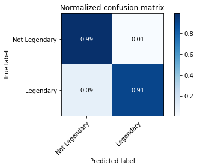


### Run model of test data


```python
X_train, X_test, y_train, y_test = train_test_split(
    design_matrix, legendary_labels, test_size = 0.15, random_state = 200)
X2_train, X_val, y2_train, y_val = train_test_split(
    X_train, y_train, test_size = 0.15, random_state = 0)

clf = LinearSVC(random_state=0, tol=1e-4, C = searched_C, max_iter=50000)
clf.fit(X2_train, y2_train)
pred_test = clf.predict(X_test)
plot_confusion_matrix(y_test, pred_test, np.array(['Not Legendary', 'Legendary']), normalize=True)
```

    Normalized confusion matrix
    [[0.99173554 0.00826446]
     [0.14285714 0.85714286]]
    


    <matplotlib.axes._subplots.AxesSubplot at 0x20b75950390>


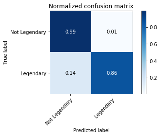


```python
print_misclass(X_test, y_test, pred_test)
```

    Mega-Diancie is not a legendary.
    Manaphy is not a legendary.
    Silvally is not a legendary.
    

## RBF Kernelized SVM

Separates data with MVGaussian function


```python
from sklearn.svm import SVC

design_matrix = df.values.astype(np.float32)
X_train, X_test, y_train, y_test = train_test_split(
    design_matrix, legendary_labels, test_size = 0.15, random_state = 20)
X_train, X_validate, y_train, y_validate = train_test_split(
    X_train, y_train, test_size = 0.15, random_state = 0)

max_acc = 0
searched_C = -1
for c in np.logspace(-0, 10, 11):
    clf = SVC(C = c, kernel = 'rbf', gamma='auto')
    clf.fit(X_train, y_train)
    
    pred_train = clf.predict(X_train)
    plot_confusion_matrix(y_train, pred_train, np.array(['Not Legendary', 'Legendary']), normalize=True)
    
    pred_validate = clf.predict(X_validate)
    cm = confusion_matrix(y_validate, pred_validate)
    cm = cm.astype('float') / cm.sum(axis=1)[:, np.newaxis]    
    validation_acc = cm[0][0]+cm[1][1]
    if validation_acc > max_acc:
        max_acc=validation_acc
        searched_C=c
        plot_confusion_matrix(y_validate, pred_validate, np.array(['Not Legendary', 'Legendary']), normalize=True)
```

    Normalized confusion matrix
    [[1. 0.]
     [0. 1.]]
    Normalized confusion matrix
    [[1. 0.]
     [1. 0.]]
    Normalized confusion matrix
    [[1. 0.]
     [0. 1.]]
    Normalized confusion matrix
    [[1.  0. ]
     [0.9 0.1]]
    Normalized confusion matrix
    [[1. 0.]
     [0. 1.]]
    Normalized confusion matrix
    [[1. 0.]
     [0. 1.]]
    Normalized confusion matrix
    [[1. 0.]
     [0. 1.]]
    Normalized confusion matrix
    [[1. 0.]
     [0. 1.]]
    Normalized confusion matrix
    [[1. 0.]
     [0. 1.]]
    Normalized confusion matrix
    [[1. 0.]
     [0. 1.]]
    Normalized confusion matrix
    [[1. 0.]
     [0. 1.]]
    Normalized confusion matrix
    [[1. 0.]
     [0. 1.]]
    Normalized confusion matrix
    [[1. 0.]
     [0. 1.]]
    


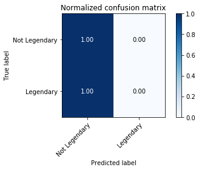


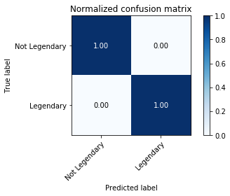


```python
X_train, X_test, y_train, y_test = train_test_split(
    design_matrix, legendary_labels, test_size = 0.15, random_state = 200)
X2_train, X_val, y2_train, y_val = train_test_split(
    X_train, y_train, test_size = 0.15, random_state = 0)

clf = SVC(C = searched_C, kernel = 'rbf', gamma='auto')
clf.fit(X2_train, y2_train)
pred_test = clf.predict(X_test)
plot_confusion_matrix(y_test, pred_test, np.array(['Not Legendary', 'Legendary']), normalize=True)
```

    Normalized confusion matrix
    [[1.         0.        ]
     [0.85714286 0.14285714]]
    


    <matplotlib.axes._subplots.AxesSubplot at 0x20b7768bc50>


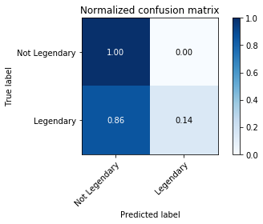


## Logistic Regression

Fits binary classification as probabilities.


```python
from sklearn import linear_model
from sklearn.linear_model import LogisticRegressionCV
from sklearn.model_selection import train_test_split

design_matrix = df.values.astype(np.float32)
X_train, X_test, y_train, y_test = train_test_split(
    design_matrix, legendary_labels, test_size = 0.4, random_state = 69)
```


```python
import time

reg = LogisticRegressionCV(Cs=np.logspace(-10, 10, 41), 
                           fit_intercept=True,
                           dual = False,
                          solver='lbfgs',
                           tol=1e-6,
                          max_iter=1e5)

start = time.time()
reg.fit(X_train, y_train)
end = time.time()
print("Fitting took %s ms" % str(end-start))
```

    D:\Anaconda\lib\site-packages\sklearn\model_selection\_split.py:1978: FutureWarning: The default value of cv will change from 3 to 5 in version 0.22. Specify it explicitly to silence this warning.
      warnings.warn(CV_WARNING, FutureWarning)
    

    Fitting took 3.224463939666748 ms
    


```python
pred_train = reg.predict(X_train)
plot_confusion_matrix(y_train, pred_train, np.array(['Not Legendary', 'Legendary']), normalize=True)

pred_test = reg.predict(X_test)
plot_confusion_matrix(y_test, pred_test, np.array(['Not Legendary', 'Legendary']), normalize=True)
```

    Normalized confusion matrix
    [[0.99796748 0.00203252]
     [0.10638298 0.89361702]]
    Normalized confusion matrix
    [[0.99679487 0.00320513]
     [0.0625     0.9375    ]]
    


    <matplotlib.axes._subplots.AxesSubplot at 0x20b77869438>


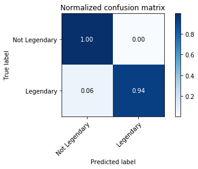


```python
#print_misclass(X_train, y_train, pred_train)
pred_test = reg.predict(X_train)
#print_misclass(X_test, y_test, pred_test)

match_names = poke_names[X_train[:,10]-1].values
pred_test = reg.predict_proba(X_train)
as_prob = np.around(pred_test, decimals=5)[:,1]
for i in range(len(match_names)):
    print('{:>15}: {:.3%}'.format(match_names[i], as_prob[i]))
```

            Volbeat: 3.740%
          Lilligant: 1.800%
           Sharpedo: 0.473%
         Gothitelle: 1.556%
          Vileplume: 1.121%
            Honedge: 0.941%
         Kricketune: 0.887%
        Mega Pinsir: 0.971%
          Clawitzer: 0.402%
           Stantler: 0.481%
          Mightyena: 0.646%
            Pancham: 1.056%
              Lotad: 0.238%
            Marowak: 1.287%
            Shaymin: 98.895%
             Combee: 0.592%
            Cubchoo: 1.323%
            Roselia: 0.707%
           Tsareena: 1.737%
              Minun: 0.679%
            Cosmoem: 97.762%
          Kricketot: 0.259%
      Deoxys-Normal: 98.132%
            Dartrix: 1.022%
      Mega Gyarados: 0.163%
           Oranguru: 0.658%
            Cradily: 21.270%
           Genesect: 98.380%
           Porygon2: 2.426%
              Bagon: 3.097%
           Medicham: 1.337%
         Type: Null: 98.447%
             Emolga: 0.773%
            Geodude: 0.201%
          Heliolisk: 1.854%
           Hoothoot: 0.288%
          Excadrill: 1.577%
           Simisage: 1.477%
         Mega Absol: 2.878%
           Beheeyem: 1.547%
            Walrein: 1.215%
            Glaceon: 6.628%
    Wishiwashi-Solo: 3.814%
             Lileep: 22.631%
    Alolan-Raticate: 0.920%
            Litwick: 0.662%
            Kingdra: 1.569%
    Meloetta-Pirouette: 98.219%
            Treecko: 1.299%
           Hawlucha: 1.476%
          Tapu Fini: 0.893%
              Yanma: 1.355%
          Araquanid: 1.038%
             Marill: 0.766%
           Primeape: 1.214%
            Sandile: 0.648%
          Gourgeist: 1.883%
          Magnemite: 1.017%
            Braixen: 1.564%
            Breloom: 0.036%
              Snivy: 1.473%
           Morelull: 0.977%
             Kyurem: 98.077%
           Shellder: 0.193%
             Pidgey: 0.202%
           Basculin: 10.946%
             Audino: 1.288%
            Shiftry: 0.789%
          Rhyperior: 0.506%
             Durant: 1.530%
           Doublade: 1.594%
            Gurdurr: 1.008%
           Squirtle: 1.121%
             Feebas: 3.596%
           Cinccino: 3.182%
            Leafeon: 6.247%
             Weedle: 0.271%
            Aurorus: 4.042%
          Gothorita: 1.163%
            Omastar: 3.454%
             Latios: 96.590%
            Panpour: 0.769%
              Unown: 4.190%
             Gabite: 2.885%
            Machamp: 0.982%
       Deoxys-Speed: 98.605%
            Pupitar: 2.679%
          Jellicent: 1.750%
             Tyrunt: 4.651%
          Probopass: 1.662%
             Mothim: 1.118%
          Amoonguss: 1.571%
         Charmeleon: 1.074%
          Poliwrath: 1.069%
            Luvdisc: 1.674%
             Emboar: 1.196%
      Hoopa-Unbound: 98.023%
       Mega Lopunny: 1.864%
           Cutiefly: 0.949%
            Altaria: 11.227%
           Meowstic: 1.806%
     Alolan-Geodude: 0.318%
          Decidueye: 0.994%
           Rapidash: 1.338%
          Electrode: 2.137%
         Masquerain: 0.955%
           Tirtouga: 4.419%
          Combusken: 1.215%
             Ledian: 2.201%
           Illumise: 0.029%
            Flaaffy: 0.768%
      Mega-Camerupt: 1.108%
           Castform: 2.723%
           Arcanine: 0.323%
      Alolan-Vulpix: 1.064%
          Trevenant: 1.855%
          Growlithe: 0.175%
             Woobat: 0.530%
         Victreebel: 1.099%
           Houndoom: 0.515%
     Primal Groudon: 97.972%
     Mega Heracross: 0.927%
            Persian: 1.132%
             Palkia: 98.037%
             Cacnea: 0.560%
             Espeon: 5.375%
           Virizion: 65.284%
           Vikavolt: 1.467%
          Lickitung: 1.519%
            Groudon: 97.390%
              Ekans: 0.411%
           Parasect: 1.237%
               Aron: 0.824%
            Turtwig: 1.339%
            Mudbray: 0.838%
           Barboach: 0.740%
            Ninjask: 4.684%
            Chespin: 1.560%
            Pangoro: 2.533%
         Jigglypuff: 0.758%
             Kakuna: 0.652%
             Dewott: 1.372%
         Aerodactyl: 1.470%
            Bayleef: 1.167%
          Pidgeotto: 0.457%
           Quagsire: 1.148%
      Mega Venusaur: 1.528%
            Kartana: 92.550%
           Hariyama: 0.021%
          Hitmonlee: 2.153%
           Carvanha: 0.177%
           Gyarados: 0.115%
          Palpitoad: 0.918%
            Skorupi: 0.372%
            Popplio: 1.100%
            Whismur: 0.525%
     Mega Abomasnow: 0.567%
           Venomoth: 1.256%
           Sawsbuck: 1.577%
             Dodrio: 1.475%
             Spoink: 1.273%
           Nosepass: 0.481%
      Mega Medicham: 1.730%
           Alakazam: 1.111%
            Gliscor: 1.515%
            Boldore: 0.569%
          Charjabug: 0.925%
            Kingler: 1.346%
            Sylveon: 6.799%
            Lanturn: 0.367%
          Electrike: 0.346%
            Mesprit: 60.668%
           Qwilfish: 1.632%
           Cottonee: 0.861%
             Golbat: 0.721%
          Poliwhirl: 0.707%
           Corphish: 0.019%
           Phantump: 1.429%
           Nidorino: 0.651%
           Slurpuff: 1.152%
           Cacturne: 1.214%
             Hoppip: 0.346%
             Elekid: 2.561%
              Lugia: 97.817%
         Lickilicky: 1.887%
    Aegislash-Shield: 2.452%
            Beartic: 1.609%
           Stunfisk: 1.638%
               Seel: 0.613%
            Heatmor: 1.491%
            Banette: 7.093%
             Goodra: 3.350%
           Remoraid: 0.699%
          Mamoswine: 0.454%
            Taillow: 0.331%
          Toxicroak: 1.475%
            Goldeen: 0.513%
     Ultra Necrozma: 98.365%
           Dusclops: 5.836%
        Mega Aggron: 2.172%
           Purrloin: 0.541%
             Grimer: 0.590%
            Mantyke: 1.071%
            Lopunny: 1.514%
           Frillish: 0.856%
           Smeargle: 4.560%
          Gardevoir: 0.552%
           Froslass: 1.683%
       Alolan-Golem: 1.028%
            Murkrow: 1.445%
              Ralts: 0.178%
            Ivysaur: 1.076%
          Salamence: 2.677%
          Cresselia: 96.995%
        Shaymin-Sky: 99.088%
            Slakoth: 0.089%
              Hypno: 1.233%
               Axew: 2.909%
    Mega Kangaskhan: 2.183%
           Larvitar: 2.874%
          Tentacool: 0.192%
           Clamperl: 3.386%
             Chatot: 1.646%
            Duosion: 1.130%
         Ferrothorn: 1.478%
          Primarina: 1.030%
            Weezing: 1.413%
             Pidove: 0.263%
              Arbok: 1.095%
    Dusk Make Necrozma: 98.273%
          Cyndaquil: 1.223%
          Manectric: 0.518%
            Drapion: 0.549%
            Starmie: 0.635%
              Klink: 1.432%
           Lumineon: 10.116%
           Torterra: 1.110%
            Nincada: 2.211%
             Fearow: 0.719%
          Azumarill: 1.488%
            Wingull: 0.735%
            Scrafty: 0.987%
           Magneton: 2.165%
               Abra: 0.457%
          Reuniclus: 1.411%
            Drilbur: 1.227%
            Buneary: 0.848%
            Seaking: 1.372%
          Tapu Lele: 0.887%
           Meloetta: 98.130%
            Kadabra: 0.832%
           Venipede: 0.277%
            Diglett: 0.436%
            Solrock: 9.056%
            Carbink: 1.437%
    Lycanroc-Midday: 1.046%
           Beedrill: 0.965%
          Metagross: 4.687%
             Metang: 5.596%
          Porygon-Z: 3.047%
            Glameow: 2.100%
             Stunky: 0.597%
             Mudkip: 1.255%
           Spritzee: 0.810%
           Sceptile: 1.177%
          Gastrodon: 1.431%
    Tornadus-Therian: 97.331%
           Lillipup: 0.261%
           Jangmo-o: 3.773%
              Burmy: 0.827%
           Rayquaza: 97.236%
            Haunter: 0.930%
         Crabrawler: 0.721%
          Diggersby: 0.814%
              Aipom: 4.319%
           Zweilous: 3.410%
           Makuhita: 0.031%
     Mega Tyranitar: 3.186%
          Sandygast: 0.838%
            Omanyte: 3.748%
       Mega-Steelix: 3.187%
              Entei: 58.318%
             Kirlia: 0.366%
    Zygarde-Complete: 98.072%
           Nidoking: 0.985%
         Galvantula: 1.689%
             Lombre: 0.539%
             Pinsir: 0.677%
             Bewear: 1.075%
             Vulpix: 0.664%
          Relicanth: 2.846%
      Mega Blaziken: 1.500%
     Darmanitan-Zen: 1.566%
            Lucario: 1.955%
           Bunnelby: 0.395%
            Poliwag: 0.312%
            Tympole: 0.405%
           Lurantis: 1.813%
            Delphox: 1.501%
          Staraptor: 0.842%
          Mandibuzz: 0.605%
         Whimsicott: 1.682%
           Floatzel: 1.440%
             Meowth: 0.418%
     Mega Gardevoir: 0.741%
             Slugma: 0.707%
            Pansage: 0.767%
            Florges: 2.330%
           Gigalith: 0.843%
           Unfezant: 0.915%
         Scatterbug: 0.397%
            Swellow: 0.846%
            Manaphy: 0.461%
          Terrakion: 63.886%
           Prinplup: 1.329%
          Rampardos: 19.966%
             Beldum: 6.044%
           Greninja: 1.408%
            Tyrogue: 2.131%
             Plusle: 0.673%
           Politoed: 1.182%
           Snubbull: 1.790%
            Yanmega: 2.022%
         Kangaskhan: 1.520%
            Grubbin: 0.399%
            Sliggoo: 3.668%
             Mewtwo: 97.711%
          Pyukumuku: 3.716%
          Carnivine: 0.307%
       Mega Lucario: 2.350%
             Swanna: 1.989%
           Torracat: 1.031%
         Krookodile: 1.351%
         Togedemaru: 0.409%
           Mareanie: 0.931%
            Togetic: 1.546%
      Mega Mewtwo X: 98.308%
        Fletchinder: 0.657%
            Scyther: 2.259%
          Vanilluxe: 0.595%
          Vespiquen: 0.981%
            Slaking: 0.264%
         Fletchling: 0.289%
             Grotle: 1.241%
      Alolan-Raichu: 0.865%
          Cryogonal: 5.108%
           Clefable: 1.732%
            Dugtrio: 1.495%
             Celebi: 98.729%
              Riolu: 1.757%
            Milotic: 9.845%
             Golurk: 2.985%
            Purugly: 4.050%
           Cobalion: 64.768%
            Kommo-o: 3.394%
              Absol: 2.256%
             Wooper: 0.444%
             Krabby: 0.501%
            Dedenne: 0.938%
           Chinchou: 0.193%
            Finneon: 5.324%
         Bouffalant: 1.899%
          Girafarig: 1.476%
           Larvesta: 3.334%
              Rotom: 3.040%
           Blaziken: 1.129%
            Koffing: 0.652%
              Magby: 2.543%
            Huntail: 10.510%
           Maractus: 0.510%
        Rotom-Frost: 3.671%
            Shuckle: 0.566%
             Wimpod: 1.878%
           Oshawott: 1.450%
          Toucannon: 1.386%
             Amaura: 4.655%
        Mega-Glalie: 1.721%
           Houndour: 0.344%
              Eevee: 5.326%
            Nuzleaf: 0.519%
            Pignite: 1.301%
             Mawile: 4.608%
           Meganium: 1.083%
          Druddigon: 4.338%
            Bronzor: 0.769%
            Liepard: 1.449%
          Shroomish: 0.014%
           Garbodor: 1.729%
       Mega Banette: 8.749%
             Lunala: 97.811%
           Croconaw: 1.139%
    Giratina-Origin: 98.051%
       Mega Gallade: 0.656%
            Fraxure: 3.002%
          Vanillite: 0.170%
     Mega Salamence: 3.520%
             Pyroar: 1.435%
             Golett: 1.853%
       Crabominable: 1.756%
            Anorith: 22.264%
            Moltres: 59.437%
             Furret: 0.763%
      Deoxys-Attack: 98.508%
           Raticate: 0.254%
          Teddiursa: 1.038%
             Cosmog: 98.302%
             Dustox: 1.167%
           Vivillon: 1.413%
           Camerupt: 0.833%
         Aromatisse: 1.130%
            Slowbro: 1.200%
     Alolan-Rattata: 0.440%
     Mega Blastoise: 1.556%
            Toxapex: 1.947%
             Mareep: 0.379%
            Rhyhorn: 0.269%
            Sableye: 2.167%
           Magikarp: 0.039%
               Onix: 2.371%
         Wigglytuff: 1.543%
     Wormadam-Plant: 1.368%
            Wailord: 0.286%
     Alolan-Diglett: 0.697%
            Azurill: 1.140%
           Munchlax: 2.385%
            Miltank: 0.501%
            Pikipek: 0.399%
            Shelmet: 0.540%
            Armaldo: 20.822%
             Klefki: 4.768%
             Cubone: 0.645%
         Typhlosion: 1.095%
            Pikachu: 0.272%
          Clauncher: 0.141%
          Tangrowth: 1.892%
    Mega Aerodactyl: 2.079%
          Ninetales: 1.273%
            Solosis: 0.618%
            Vullaby: 0.283%
        Mega-Latias: 97.771%
            Torchic: 1.280%
           Gorebyss: 10.723%
      Minior-Meteor: 4.298%
             Machop: 0.455%
             Horsea: 0.540%
           Monferno: 1.304%
           Braviary: 0.476%
            Servine: 1.416%
      Mega-Sharpedo: 0.636%
            Steenee: 1.192%
           Leavanny: 0.947%
          Thundurus: 96.985%
           Shedinja: 11.941%
    Alolan-Sandshrew: 0.630%
            Yungoos: 0.393%
             Skrelp: 0.718%
           Trubbish: 0.836%
         Farfetch'd: 1.562%
            Blitzle: 0.812%
            Umbreon: 5.404%
            Psyduck: 0.626%
         Turtonator: 1.870%
             Togepi: 0.772%
    Alolan-Graveler: 0.716%
    Aegislash-Blade: 2.053%
      Primal Kyogre: 98.347%
         Hippopotas: 0.701%
             Lairon: 1.396%
             Bonsly: 0.497%
           Whiscash: 1.367%
            Blissey: 16.754%
            Malamar: 1.639%
           Darumaka: 0.906%
            Sunkern: 0.400%
      Mega Ampharos: 1.665%
           Tornadus: 96.979%
            Floette: 1.449%
      Mega-Sceptile: 1.641%
     Alolan-Marowak: 2.003%
             Tauros: 0.411%
      Mega Mewtwo Y: 98.424%
          Tapu Bulu: 0.838%
            Tangela: 1.592%
            Diancie: 2.008%
            Cascoon: 0.743%
            Rufflet: 0.225%
      Mega Garchomp: 3.120%
           Togekiss: 2.270%
            Mienfoo: 1.022%
             Comfey: 5.772%
             Spheal: 0.357%
             Gengar: 1.185%
             Seedot: 0.235%
          Honchkrow: 1.485%
             Staryu: 0.238%
           Hakamo-o: 3.633%
           Pawniard: 1.406%
    Alolan-Sandslash: 1.704%
    Landorus-Therian: 97.180%
          Rotom-Fan: 3.679%
           Slowking: 1.333%
               Xatu: 1.347%
              Budew: 0.392%
            Snorlax: 2.003%
         Incineroar: 0.945%
            Swirlix: 0.831%
    Mega Charizard Y: 1.560%
           Cranidos: 21.643%
            Dwebble: 0.819%
              Golem: 0.660%
           Cloyster: 0.407%
           Mr. Mime: 2.553%
            Binacle: 1.420%
          Bounsweet: 0.584%
           Krokorok: 1.125%
          Marshtomp: 1.192%
         Seismitoad: 1.365%
            Ariados: 2.052%
           Lunatone: 9.394%
           Swampert: 1.095%
             Archen: 4.299%
    Thundurus-Therian: 97.342%
           Salandit: 1.406%
         Hitmonchan: 2.182%
           Staravia: 0.569%
                Muk: 1.169%
            Shuppet: 2.473%
        Mega Gengar: 1.783%
            Mantine: 0.825%
          Sudowoodo: 1.386%
           Caterpie: 0.270%
           Pelipper: 1.782%
             Yamask: 1.331%
             Luxray: 1.302%
            Happiny: 13.269%
          Eelektrik: 0.562%
           Mienshao: 2.259%
             Pineco: 0.674%
            Golduck: 1.200%
    

## Decision Trees


```python
from sklearn import tree
df_copy = df
design_matrix = df_copy.values.astype(np.float32)
np.random.seed(0)
X_train, X_test, y_train, y_test = train_test_split(
    design_matrix, legendary_labels, test_size = 0.15, random_state = 69)

clf = tree.DecisionTreeClassifier(min_samples_split =5)
clf.fit(X_train, y_train)

pred_train = clf.predict(X_train)
plot_confusion_matrix(y_train, pred_train, np.array(['Not Legendary', 'Legendary']), normalize=False)
pred_test = clf.predict(X_test)
plot_confusion_matrix(y_test, pred_test, np.array(['Not Legendary', 'Legendary']), normalize=False)
```

    Confusion matrix, without normalization
    [[690   0]
     [  0  74]]
    Confusion matrix, without normalization
    [[114   0]
     [  0  21]]
    


    <matplotlib.axes._subplots.AxesSubplot at 0x20b7898b160>


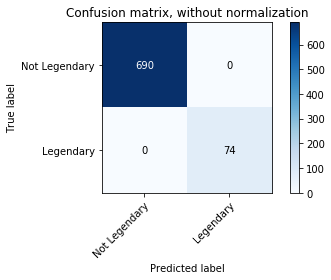


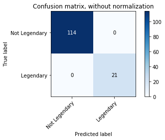


```python
print_misclass(X_train, y_train, pred_train)
#X_train[:,10]
```


```python
print_misclass(X_test, y_test, pred_test)
```


```python
# Decision Tree created
import graphviz 
dot_data = tree.export_graphviz(clf, out_file=None,
                                feature_names = df_copy.columns,
                               class_names=np.array(['Not legendary', 'legendary']),
                               special_characters=True)

graph = graphviz.Source(dot_data) 
graph
```


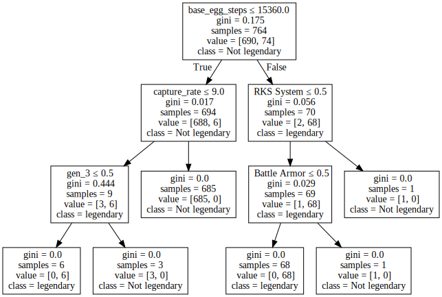


## Random Forest


```python
from sklearn.ensemble import RandomForestClassifier
#df_copy = df.drop('base_egg_steps', axis=1)
#df_copy = df_copy.drop('capture_rate', axis=1)
#df_copy = df_copy.drop('pokedex_number', axis=1)
design_matrix = df_copy.values.astype(np.float32)
np.random.seed(0)
X_train, X_test, y_train, y_test = train_test_split(
    design_matrix, legendary_labels, test_size = 0.5, random_state = 69)

clf = RandomForestClassifier(n_estimators=5000, 
                             max_depth=2,
                            max_features=100)

clf.fit(X_train, y_train)

pred_train = clf.predict(X_train)
plot_confusion_matrix(y_train, pred_train, np.array(['Not Legendary', 'Legendary']), normalize=True)
pred_test = clf.predict(X_test)
plot_confusion_matrix(y_test, pred_test, np.array(['Not Legendary', 'Legendary']), normalize=True)
```

    Normalized confusion matrix
    [[1.         0.        ]
     [0.02631579 0.97368421]]
    Normalized confusion matrix
    [[0.99491094 0.00508906]
     [0.01754386 0.98245614]]
    


    <matplotlib.axes._subplots.AxesSubplot at 0x20b77453898>


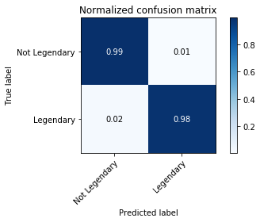


```python
from sklearn.tree import export_graphviz
dot_data = export_graphviz(clf.estimators_[np.random.randint(0,5001)], out_file=None,
                                feature_names = df_copy.columns,
                               class_names=np.array(['Not legendary', 'legendary']),
                               special_characters=True)

#Sample tree
graph = graphviz.Source(dot_data) 
graph
```


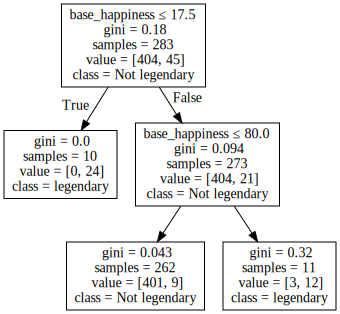


